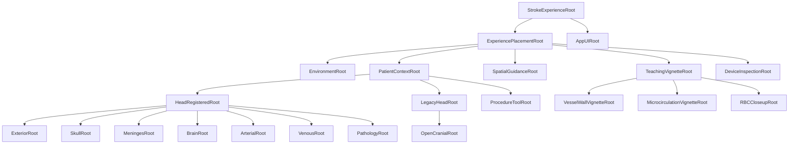
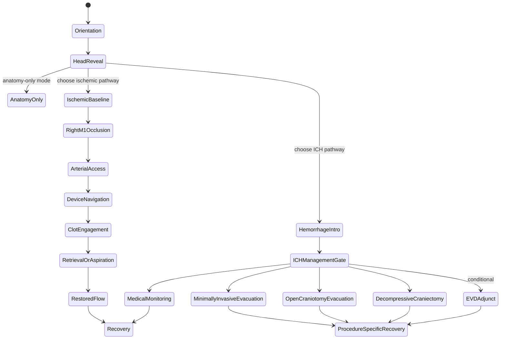

# MASTER — scene assembly, behavior, and Houdini handoff

This document is the implementation contract for assembling the repository's
65 runtime assets into one coherent Apple Vision Pro educational experience.
It is written for a coding agent, technical artist, Houdini artist, or
RealityKit engineer. The individual asset descriptions live in the
[asset catalog](RealityKitContent/Assets/README.md); this file defines how the
assets relate, which ones may coexist, what owns runtime behavior, and what
must be validated before a patient-facing pilot.

> [!CAUTION]
> This is a generic educational visualization, not a medical device, digital
> twin, fluid-dynamics model, surgical rehearsal, or representation of a
> particular patient. No animation, collision, scale cue, or device motion may
> be described as measured physiology or as predicting treatment or outcome.

## 1. Authority and sources of truth

When files disagree, use this order:

1. The six JSON manifests are authoritative for asset IDs, package paths,
   units, up axis, provenance notes, and prohibited combinations.
2. This file is authoritative for assembly, state, interaction, and pathway
   rules.
3. The [asset catalog](RealityKitContent/Assets/README.md) is authoritative for
   the human-readable inventory.
4. [Licensing](docs/assets/LICENSES.md),
   [provenance](docs/assets/PROVENANCE.md), and
   [validation](docs/assets/VALIDATION.md) are release gates, not optional
   background reading.
5. The [clinical review checklist](docs/assets/source-notes/V2_CLINICAL_REVIEW_CHECKLIST.md)
   must be signed for the exact build before any patient-facing pilot.

The word **must** below means a release-blocking requirement. **Should** means
the default implementation unless a reviewed design decision says otherwise.

## 2. Coordinate, scale, and registration contract

- Every shipped stage is authored **Y-up** with `metersPerUnit = 1`.
- The working USD/RealityKit convention is right-handed: +X right, +Y up, and
  -Z forward. This still does not establish anatomical laterality without
  landmark review.
- Preserve the imported asset transform. Do **not** add another Blender-to-USD
  `-90°` correction in Houdini, Reality Composer Pro, or RealityKit.
- Put user placement, orbit, pan, and zoom on an outer
  `ExperiencePlacementRoot`. Never overwrite the authored transforms inside a
  model to implement view controls.
- The realistic-v2 registered anatomy, head layers, cerebral arteries, flow
  overlay, clot, and cranial vasculature are intended to share the authored
  head frame where their manifest says `registered`.
- The semantic skull and eye context come from different atlas sources. Their
  alignment is approximate. Keep them separately selectable and do not treat
  their surfaces as millimetre-accurate contact boundaries.
- The artery-wall cutaway, RBC close-up, and microcirculation vignette are
  **magnified, scale-separated teaching views**. They belong in a separate
  vignette root and must never be overlaid on the head as if their relative
  dimensions were anatomical. V2 device inspection assets use a separate,
  non-registered domain but default to 1:1 scale; label them as magnified only
  when an inspection view actually changes their root scale.
- The prototype-v1 room and body assets are staging aids, not a verified
  registration frame for v2 head anatomy. Align them visually under a separate
  parent and record the chosen transform.
- Never mirror an anatomical root to obtain the other side. Laterality is
  semantic and must be reviewed. The current ischemic v2 teaching marker is a
  conceptual **right-M1** occlusion.
- Do not infer anatomical left/right from a raw X coordinate until a clinician
  has verified the imported view and an explicit project-level laterality
  mapping has been recorded.

## 3. Canonical scene graph

Use one state owner and this logical hierarchy. Exact engine class names may
change, but ownership and separation must not.



Recommended engine names and responsibilities:

| Root | Responsibility | Transform rule |
|---|---|---|
| `StrokeExperienceRoot` | Lifecycle and lesson-state owner | Identity; never directly manipulated by gestures |
| `ExperiencePlacementRoot` | World placement, global orbit, zoom, reset | Only user-controlled spatial transform |
| `EnvironmentRoot` | Table, C-arm, monitor, IV pole, staff | World-scale; static or kinematic only |
| `PatientContextRoot` | Supine patient and all patient-relative content | One reviewed visual alignment to room context |
| `HeadRegisteredRoot` | All compatible v2 head-space content | Preserve authored child transforms |
| `LegacyHeadRoot` | Prototype-v1 head/pathology staging | Separate manual alignment; never assumed registered to v2 |
| `ExteriorRoot` | Intact or cutaway scalp variant | Exactly one exterior variant active |
| `SkullRoot` | Optional semantic skull | Off by default in the combined cutaway |
| `MeningesRoot` | Dura and falx/tentorium variants | Use opaque toggles/cutaways |
| `BrainRoot` | Cortex/brain hero, deep structures, ventricles | Components may be progressively revealed |
| `ArterialRoot` | Cerebral and neck-access arteries | Static anatomy plus optional illustrative overlay |
| `VenousRoot` | Sinuses, jugulars, supplemental veins | Choose components or one aggregate, never both |
| `PathologyRoot` | Registered v2 ischemic clot and future reviewed registered pathology | Pathway-exclusive state |
| `ProcedureToolRoot` | Authored in-patient guidewire/catheter/tool poses | Kinematic narrative motion only; must have a reviewed placement |
| `DeviceInspectionRoot` | Detached v2 device inspection/comparison tray | Separate registration domain; 1:1 default, labelled if scaled; not a vessel path |
| `OpenCranialRoot` | Flap, drill, patch, evacuator, closure | Disabled for the thrombectomy pathway |
| `TeachingVignetteRoot` | Magnified, scale-separated explanations | Place beside the patient with a visible scale label |
| `SpatialGuidanceRoot` | World-space step markers and arrows | Inherits placement/orbit/scale with the experience |
| `AppUIRoot` | Captions, replay, warnings, non-spatial controls | App-owned UI; not transformed with world content |

## 4. Composition rules

### 4.1 Components versus convenience assemblies

Several packages repeat geometry from their component files. A convenience
assembly is a **replacement view**, not another layer to stack on top:

| Convenience asset | Replaces while active |
|---|---|
| `thrombectomy_registered_hero_v2.usdz` | Brain anatomy, deep structures, ventricles, semantic skull, embedded eyes, cerebral arteries, and right-M1 clot |
| `layered_head_cutaway_registered_v2.usdz` | Separate scalp cutaway, conceptual dura cutaway, meningeal partitions, and brain |
| `meningeal_partitions_atlas_v2.usdz` | Separate falx and tentorium packages |
| `dural_sinuses_jugulars_realistic_v2.usdz` | Separate dural sinuses and internal jugular packages |
| `head_neck_veins_expanded_realistic_v2.usdz` | Core sinuses/jugulars plus supplemental veins |
| `cranial_vascular_registered_assembly_v2.usdz` | Expanded venous layer plus neck-access arteries |
| `artery_cutaway_complete_v2.usdz` | Separate artery-wall and interior-flow packages |
| `cerebral_bloodflow_teaching_set_v2.usdz` | Complete cutaway, Circle-of-Willis overlay, RBC close-up, and microcirculation in a rearranged static comparison layout; it excludes the animation |
| `thrombectomy_device_set_educational_v2.usdz` | The four v2 device close-ups in a comparison layout |

Loading an aggregate and its parts together causes duplicate geometry,
z-fighting, unnecessary memory use, and ambiguous state ownership. Enforce
mutual exclusion in code rather than relying on an artist to remember it.

Exclusion must be **transitive**. Maintain a recursively expanded
`containedLeafAssetIDs` set for every component and aggregate. Before enabling
an asset, reject the transition if its leaf set intersects the leaf set of any
active asset. For example, the hero and layered-head aggregates both contain
the brain even though neither is the other's direct component; the vascular
assembly overlaps the expanded-veins aggregate; and the teaching set overlaps
the complete cutaway. All three pairs must be rejected.

### 4.2 Reveal policy

- Use opaque layer swaps, cutaway geometry, and visibility toggles. Do not stack
  transparent skin, skull, dura, vessels, and brain.
- `external_head_scalp_realistic_v2` is the intact exterior. Swap it for
  `external_head_scalp_cutaway_v2` to reveal internal anatomy.
- The opaque intact scalp will hide the skull and brain; this is correct.
- Eyes are optional orientation context and are off by default in the layered
  cutaway.
- The semantic skull is an isolated inspection layer unless its approximate
  cross-source fit has been accepted for a specific shot.
- A cutaway window is an educational reveal, not a claimed incision,
  craniotomy, operative corridor, or planned opening.

### 4.3 Pathway exclusivity

The experience has anatomy-only mode plus two distinct pathology pathways.
Within the haemorrhage pathway, management is an explicit clinician-approved
branch; open surgery is not the automatic next step. Never make these branches
appear to be successive steps of one operation.



The app must require an explicit pathway choice before enabling intervention
assets. Changing pathway performs a full state reset.

## 5. Master relationship map — all 65 runtime assets

The `Parent` column is the canonical scene slot. `Relationship / rule` tells an
agent how each package fits into the constructed experience.

### 5.1 Realistic v2 core anatomy

| # | Asset ID | Parent | Relationship / rule |
|---:|---|---|---|
| 1 | `brain_anatomy_realistic_v2` | `BrainRoot` | Preferred brain context. Base for registered arterial, clot, meningeal, and vascular layers. Keep static. |
| 2 | `brain_deep_structures_v2` | `BrainRoot/DeepStructures` | Optional progressive reveal inside the main brain; do not imply every structure is visible through opaque cortex. |
| 3 | `brain_ventricles_v2` | `BrainRoot/Ventricles` | Optional internal orientation layer; reveal after hiding/cutting the obscuring brain surface. |
| 4 | `skull_semantic_realistic_v2` | `SkullRoot` | Optional named-bone inspection. Cross-source registration is approximate; keep off in the default cutaway assembly. |
| 5 | `cerebral_arteries_realistic_v2` | `ArterialRoot/Cerebral` | Preferred static cerebral arterial anatomy; spatial host for the right-M1 clot and conceptual flow overlay. |
| 6 | `ischemic_mca_clot_v2` | `PathologyRoot/Ischemic` | Conceptual right-M1 occlusion marker. Visible only in ischemic occlusion/engagement states; never used as a lesion measurement. |
| 7 | `thrombectomy_registered_hero_v2` | `HeadRegisteredRoot/ReviewVariant` | Heavy combined review asset. Use for QA/demo stills or a lazy-loaded overview; replace its duplicated individual layers while active. |

### 5.2 Head exterior and meningeal layers

| # | Asset ID | Parent | Relationship / rule |
|---:|---|---|---|
| 8 | `external_head_scalp_realistic_v2` | `ExteriorRoot/Intact` | Default orientation exterior. Mutually exclusive with the cutaway scalp. |
| 9 | `external_head_scalp_cutaway_v2` | `ExteriorRoot/Cutaway` | Reveal variant for internal anatomy. The window is illustrative, not an operative opening. |
| 10 | `eyes_context_realistic_v2` | `HeadRegisteredRoot/Eyes` | Optional facial orientation cue. Off by default and never treated as precisely registered orbital anatomy. |
| 11 | `dura_mater_conceptual_v2` | `MeningesRoot/DuraIntact` | Conceptual opaque cerebral-hull shell. Mutually exclusive with the dura cutaway; thickness is non-physiologic. |
| 12 | `dura_mater_cutaway_conceptual_v2` | `MeningesRoot/DuraCutaway` | Reveal variant aligned with the educational head window. Not a planned dural opening. |
| 13 | `falx_cerebri_atlas_v2` | `MeningesRoot/Partitions/Falx` | Individual falx layer; hide when the combined partitions asset is active. |
| 14 | `tentorium_cerebelli_atlas_v2` | `MeningesRoot/Partitions/Tentorium` | Bilateral tentoria layer; hide when the combined partitions asset is active. |
| 15 | `meningeal_partitions_atlas_v2` | `MeningesRoot/Partitions/Combined` | Combined falx and tentoria review variant replacing assets 13–14. |
| 16 | `layered_head_cutaway_registered_v2` | `HeadRegisteredRoot/LayeredReviewVariant` | Preferred quick layered-head overview. Replaces separate scalp cutaway, dura cutaway, partitions, and main brain while active; skull/eyes remain separate. |

### 5.3 Cranial and neck vasculature

| # | Asset ID | Parent | Relationship / rule |
|---:|---|---|---|
| 17 | `dural_venous_sinuses_realistic_v2` | `VenousRoot/Core/Sinuses` | Individual 16-structure sinus layer. Purple/blue is a UI convention, not blood colour or oxygenation. |
| 18 | `internal_jugular_veins_realistic_v2` | `VenousRoot/Core/Jugulars` | Bilateral outflow context; may pair with asset 17 unless their combined package is used. |
| 19 | `dural_sinuses_jugulars_realistic_v2` | `VenousRoot/Core/Combined` | Replaces assets 17–18 for a single progressive layer. |
| 20 | `head_neck_veins_supplemental_v2` | `VenousRoot/Supplemental` | Adds facial, scalp, ophthalmic, vertebral, jugular, and neck context to assets 17–19. Excludes the core group. |
| 21 | `head_neck_veins_expanded_realistic_v2` | `VenousRoot/Expanded` | Complete 56-structure venous variant replacing assets 17–20. |
| 22 | `neck_access_arteries_realistic_v2` | `ArterialRoot/NeckAccess` | Carotid/vertebral access context. May pair with cerebral arteries after reviewed registration; do not imply a patient-specific catheter route. |
| 23 | `cranial_vascular_registered_assembly_v2` | `HeadRegisteredRoot/VascularReviewVariant` | Combined expanded veins and neck-access arteries. Replaces assets 17–22 while active; intended for review, not the default patient scene. |

### 5.4 Blood-flow teaching views

| # | Asset ID | Parent | Relationship / rule |
|---:|---|---|---|
| 24 | `artery_wall_cutaway_v2` | `TeachingVignetteRoot/VesselWall/Wall` | Magnified wall-only reveal. Pair with asset 25 or replace both with asset 26. |
| 25 | `artery_interior_bloodflow_v2` | `TeachingVignetteRoot/VesselWall/Interior` | Magnified lumen, cells, arrows, and streamlines. Illustrative only; may be added after asset 24. |
| 26 | `artery_cutaway_complete_v2` | `TeachingVignetteRoot/VesselWall/Combined` | Replaces assets 24–25 for a combined cutaway. |
| 27 | `circle_of_willis_flow_overlay_v2` | `ArterialRoot/FlowOverlay` | Conceptual directional overlay in the v2 head frame. It may accompany cerebral arteries but must not be called perfusion or CFD. |
| 28 | `red_blood_cells_closeup_v2` | `TeachingVignetteRoot/RBCCloseup` | Magnified cell-form vignette. Never compare its size directly with head or artery geometry. |
| 29 | `microcirculation_arterial_venous_v2` | `TeachingVignetteRoot/Microcirculation` | Scale-separated arteriole–capillary–venule explanation. It is not a continuation of the registered cranial vessel mesh. |
| 30 | `cerebral_bloodflow_animation_v2` | `ArterialRoot/AnimatedFlowCue` | Four-second baked transform cue with 24 imported animation resources. Explicitly play/replay; no physical time or velocity meaning. |
| 31 | `cerebral_bloodflow_teaching_set_v2` | `TeachingVignetteRoot/ReviewVariant` | Static comparison set replacing the relevant individual teaching vignettes while active. Keep outside the anatomical-scale head root. |

### 5.5 Generic v2 thrombectomy-device concepts

| # | Asset ID | Parent | Relationship / rule |
|---:|---|---|---|
| 32 | `guidewire_educational_v2` | `DeviceInspectionRoot/Guidewire` | Generic detached close-up. It is not registered to the body or vessel. A procedural instance requires a separately authored path/pose layer. No sizing, force, or tip-behaviour claim. |
| 33 | `microcatheter_educational_v2` | `DeviceInspectionRoot/Microcatheter` | Detached delivery-catheter concept. It is not registered to the patient; do not infer wall contact from overlap. |
| 34 | `aspiration_catheter_educational_v2` | `DeviceInspectionRoot/AspirationCatheter` | Detached aspiration concept. Its lumen and construction are illustrative, not a product specification or registered pathway. |
| 35 | `stent_retriever_educational_v2` | `DeviceInspectionRoot/StentRetriever` | Detached conceptual deployed lattice. Use only in the ischemic arterial lesson and never for ICH evacuation. |
| 36 | `thrombectomy_device_set_educational_v2` | `DeviceInspectionRoot/Comparison` | Four-device comparison layout replacing assets 32–35 as close-ups. It is not registered inside the patient or vessel. |

### 5.6 Prototype-v1 anatomy and pathology

| # | Asset ID | Parent | Relationship / rule |
|---:|---|---|---|
| 37 | `head_skin_generic` | `LegacyHeadRoot/Exterior` | Low-poly fallback only. Prefer v2 intact/cutaway exterior for patient-facing visuals. Do not overlay it on the v2 head frame. |
| 38 | `skull_cranium_generic` | `LegacyHeadRoot/Skull` | Low-poly sequencing fallback; do not stack with the v2 skull. |
| 39 | `brain_structures_generic` | `LegacyHeadRoot/Brain` | Low-poly brain fallback; do not combine with v2 brain as if complementary anatomy. |
| 40 | `cerebral_arteries_generic` | `LegacyHeadRoot/Arterial` | Low-poly arterial fallback; replace with v2 arteries where possible. |
| 41 | `ischemic_lvo_clot` | `LegacyHeadRoot/Pathology/Ischemic` | Prototype obstruction cue. Use instead of, not in addition to, the v2 right-M1 clot. |
| 42 | `ich_hematoma` | `LegacyHeadRoot/Pathology/Hemorrhage` | Conceptual escaped-blood volume for the separate haemorrhage pathway. Never remove it with a stent retriever. |
| 43 | `edema_swelling` | `LegacyHeadRoot/Pathology/Edema` | Conceptual swelling state. It may accompany a reviewed haemorrhage/decompression explanation, not a quantitative pressure simulation. |

### 5.7 Prototype-v1 room and patient context

| # | Asset ID | Parent | Relationship / rule |
|---:|---|---|---|
| 44 | `patient_supine_generic` | `PatientContextRoot/Body` | Neutral body/context shell. Visually align the head root under it; do not claim anatomical registration. |
| 45 | `angiography_operating_table` | `EnvironmentRoot/Table` | Static room anchor; parent the patient context to a reviewed table transform if helpful. |
| 46 | `vital_sign_monitor` | `EnvironmentRoot/Monitor` | Static contextual prop. Never show fabricated patient measurements as real data. |
| 47 | `iv_pole_and_bag` | `EnvironmentRoot/IV` | Static contextual prop; no medication, dose, or infusion claim. |
| 48 | `clinical_team_generic` | `EnvironmentRoot/Staff` | Static/kinematic scale context. Avoid implying these silhouettes represent the actual treating team. |

### 5.8 Prototype-v1 mechanical-thrombectomy sequence

| # | Asset ID | Parent | Relationship / rule |
|---:|---|---|---|
| 49 | `angiography_c_arm` | `EnvironmentRoot/Imaging` | Static/kinematic room context. A pose change is illustrative, not a collision-checked equipment motion. |
| 50 | `arterial_access_site` | `PatientContextRoot/AccessCue` | Conceptual entry-point vignette for the ischemic endovascular path; specialist must review terminology and position. |
| 51 | `catheter_body_to_brain_route` | `PatientContextRoot/RouteCue` | Conceptual route joining body context to head context. Do not call it a patient-specific vascular path. |
| 52 | `guidewire_microcatheter_set` | `ProcedureToolRoot/PrototypeDelivery` | Separated low-poly components suited to an authored transform sequence. Prefer v2 devices for detached close-up appearance. |
| 53 | `stent_retriever` | `ProcedureToolRoot/PrototypeRetriever` | Prototype captured-clot cue. Alternative to the v2 close-up, never combined with ICH. |
| 54 | `aspiration_catheter` | `ProcedureToolRoot/PrototypeAspiration` | Prototype alternative route. Do not show aspiration and retrieval as simultaneous unless narration explicitly compares techniques. |
| 55 | `angiography_contrast_flow` | `LegacyHeadRoot/Arterial/ContrastCue` | Conceptual before/after filling overlay for the prototype arterial frame. It is not an angiogram, dose, timing curve, or reperfusion grade. |

### 5.9 Prototype-v1 open-cranial and haemorrhage concepts

| # | Asset ID | Parent | Relationship / rule |
|---:|---|---|---|
| 56 | `scalp_incision_flap` | `OpenCranialRoot/ScalpFlap` | Non-graphic open-cranial reveal. Prohibited in a thrombectomy-only sequence. |
| 57 | `craniotomy_bone_flap` | `OpenCranialRoot/BoneFlap` | Kinematic removable bone concept. If the state is labelled decompressive craniectomy, do not replace it at the end. |
| 58 | `cranial_drill_generic` | `OpenCranialRoot/Drill` | Stylised tool shown only in the reviewed open-cranial pathway; no cutting-force or trajectory claim. |
| 59 | `suction_and_forceps` | `OpenCranialRoot/Instruments` | Separated open-surgery concepts. Do not depict interaction with anatomy as validated tissue mechanics. |
| 60 | `scalp_closure_sutures` | `OpenCranialRoot/Closure` | Non-graphic closed-incision state for an applicable closure narrative. |
| 61 | `dural_patch` | `OpenCranialRoot/DuralPatch` | Configurable expansion/repair teaching object; only for a clinician-reviewed applicable procedure. |
| 62 | `minimally_invasive_evacuator_port` | `OpenCranialRoot/Evacuator` | Conceptual haemorrhage-evacuation trajectory. Keep distinct from arterial thrombectomy devices. |
| 63 | `optional_evd_system` | `OpenCranialRoot/EVD` | Optional ventricular drainage concept, never a universal/default stroke step. It has no assumed registration to the v2 ventricles; any combined view needs an authored, reviewed transform. |

### 5.10 Recovery and guidance

| # | Asset ID | Parent | Relationship / rule |
|---:|---|---|---|
| 64 | `postoperative_head_dressing` | `LegacyHeadRoot/Recovery` | Generic v1 head-space dressing only after an applicable cranial-access procedure. Do not use after ordinary thrombectomy or monitoring-only care; any non-legacy placement needs a reviewed transform. It is not evidence of success. |
| 65 | `spatial_step_markers` | `SpatialGuidanceRoot/Markers` | Eight markers in one wide entity. Use as authored or create app-owned labels; do not place the entire package at head origin or imply that every pathway has eight steps. |

## 6. Recommended lesson assembly

### 6.1 Orientation and layer reveal

1. Load the room context only if it materially helps the lesson: table, patient,
   monitor, IV pole, staff, and C-arm.
2. Load `external_head_scalp_realistic_v2` under `ExteriorRoot` and the brain
   asynchronously but keep internal layers disabled.
3. On **Reveal**, swap the intact scalp for
   `external_head_scalp_cutaway_v2`; do not fade multiple transparent shells
   through each other.
4. Progressively enable the conceptual dura cutaway, falx/tentorium or their
   combined variant, brain, arteries, and optional venous context.
5. Offer deep structures, ventricles, eyes, and skull as separately labelled
   optional inspection layers.
6. Reset restores the intact exterior, default camera/placement transform,
   ischemic/haemorrhage choice to `none`, and all optional layers to off.

### 6.2 Ischemic thrombectomy educational path

| State | Show | Hide / replace | App behavior |
|---|---|---|---|
| `ischemicBaseline` | Brain + cerebral arteries + optional flow overlay/animation | Clot and devices | Label flow cues illustrative |
| `rightM1Occlusion` | Add `ischemic_mca_clot_v2`; change overlay to restricted-flow styling in app | Restored-flow cue | Use a discrete lesson state, not simulated pressure |
| `arterialAccess` | Room C-arm, access-site cue, neck arteries, route cue | Open-cranial root | Add narration and a reviewed body-to-head path |
| `deviceNavigation` | Reviewed procedural guidewire/microcatheter pose sequence; v2 devices may appear in a detached close-up | Unused alternative device | Move a derived procedural instance kinematically along an authored guide path |
| `clotEngagement` | Stent-retriever **or** aspiration concept with clot visible | Haemorrhage assets | Use authored poses; no tissue/device force claim |
| `retrievalOrAspiration` | Animate selected device and clot cue to a completed state | Competing treatment animation | Reparent/hide the clot at a deterministic event marker |
| `restoredFlow` | Remove occlusion cue; replay a clearly labelled conceptual flow animation/contrast cue | Engaged-clot state | Never claim a reperfusion grade, velocity, or outcome |
| `recovery` | Neutral head/patient monitoring context | Intervention close-ups and cranial dressing | Ordinary thrombectomy does not create a cranial incision; explain uncertainty without guarantees |

The stent-retriever and aspiration options are alternative explanations. If
shown in one lesson, present them as a comparison with an explicit reset
between them.

### 6.3 Haemorrhage/open-cranial educational path

1. Reset and unload every endovascular clot-removal/device state.
2. Switch to `LegacyHeadRoot` and use the v1 brain/head context with
   `ich_hematoma` and, only if the reviewed lesson needs it,
   `edema_swelling`. These pathology assets are not registered to the v2 head.
   Disable `HeadRegisteredRoot` unless a derived v1-to-v2 transform has been
   explicitly authored and specialist-reviewed for the exact combined view.
3. Enter a management gate: medical monitoring, minimally invasive evacuation,
   open craniotomy evacuation, decompressive craniectomy, or a conditional EVD
   adjunct. Do not imply that every ICH receives surgery.
4. Use scalp flap, bone flap, drill, evacuator port, EVD, instruments, dural
   patch, closure, and dressing only in the sequence approved for the exact
   selected branch.
5. A decompressive craniectomy is not clot removal. If a step is labelled
   decompressive craniectomy, do not animate replacement of the bone flap.
6. Do not imply every haemorrhagic stroke needs open surgery, evacuation, EVD,
   patching, or the same recovery path.

### 6.4 Procedure-specific recovery

- Monitoring-only: no surgical closure or dressing.
- Ordinary thrombectomy: no cranial sutures, bone flap, or head dressing;
  return to monitoring/context and preserve uncertainty.
- Open craniotomy: a reviewed sequence may replace the bone flap, show scalp
  closure, then show a dressing.
- Decompressive craniectomy: the bone flap remains absent in that operation;
  a reviewed scalp closure/dressing may follow.
- Minimally invasive evacuation or EVD: show only the access/device/dressing
  approved for that branch.
- Never animate the brain instantly returning to normal, a neurological deficit
  disappearing, a recovery percentage, or a guaranteed outcome.

## 7. Runtime state and deterministic logic

One reducer/state machine must be the only writer of asset visibility. Scene
entities should not decide clinical sequence independently. The engine must
never infer treatment from geometry, a monitor display, symptoms, or user
gestures. A clinician-approved lesson configuration selects the branch;
otherwise only anatomy-only mode is available.

```swift
enum EducationPathway: String, Codable, Hashable {
    case none
    case ischemicThrombectomy
    case intracerebralHemorrhage
}

enum LessonStep: String, Codable {
    case orientation, headReveal, baselineFlow, occlusion
    case arterialAccess, deviceNavigation, clotEngagement
    case retrievalOrAspiration, restoredFlow
    case hemorrhageIntro, ichManagementGate, medicalMonitoring
    case minimallyInvasiveEvacuation, openCraniotomyEvacuation
    case decompressiveCraniectomy, evdAdjunct
    case procedureSpecificRecovery, recovery
}

enum FlowPresentation: String, Codable {
    case hidden, baselineIllustrative, restrictedIllustrative, restoredIllustrative
}

enum ICHManagementBranch: String, Codable {
    case none, medicalMonitoring, minimallyInvasiveEvacuation
    case openCraniotomyEvacuation, decompressiveCraniectomy, evdAdjunct
}

struct StrokeExperienceState: Equatable {
    var pathway: EducationPathway = .none
    var step: LessonStep = .orientation
    var visibleAssetIDs: Set<String> = []
    var selectedAggregateIDs: Set<String> = []
    var flow: FlowPresentation = .hidden
    var ichManagement: ICHManagementBranch = .none
    var magnifiedViewIsActive = false
    var animationRevision = 0       // increment to replay deterministically
    var clinicalWarningsVisible = true
}

struct AssetAssemblyRule: Decodable {
    let assetID: String
    let canonicalParent: String
    let frameID: String              // registered_v2, legacy_v1, vignette, device_tray
    let directContainedAssetIDs: Set<String>
    let allowedPathways: Set<EducationPathway>
    let scaleMode: String            // anatomical_1_to_1, magnified, or detached_1_to_1
    let requiresClinicalApproval: Bool
}
```

Build `containedLeafAssetIDs` as the recursive closure of
`directContainedAssetIDs`; a non-composite asset's closure is the asset itself.
Cache that graph after validating that it is acyclic, then use it for every
visibility transition and duplication test.

Reducer invariants:

```text
if pathway changes:
    stop all animations
    clear device/clot/open-cranial states
    restore the reviewed default layer set

if an aggregate becomes visible:
    recursively expand its containedLeafAssetIDs
    reject if that set intersects any active asset's expanded leaf set

if ischemicThrombectomy:
    OpenCranialRoot.isEnabled = false
    ich_hematoma and edema_swelling are disabled

if intracerebralHemorrhage:
    ProcedureToolRoot endovascular children are disabled
    DeviceInspectionRoot endovascular treatment comparison is disabled
    ischemic clot and arterial retrieval cues are disabled

if ichManagement == evdAdjunct and lesson configuration lacks EVD approval:
    reject the transition and keep the prior state

if magnified vignette is active:
    show “Magnified educational view — not to anatomical scale”

if DeviceInspectionRoot scale != 1:
    show “Magnified educational view” and an explicit scale indicator

on reset:
    restore placement/orbit/zoom, visibility, pathway, step, labels,
    animation time, highlights, and interaction selections
```

Asset entities should be keyed by the manifest ID, not an imported USD root
name. After loading, set the outer container's name to the manifest ID. Do not
assume every package has a unique internal `defaultPrim` name.

## 8. Physics and animation contract

“Physics” in this project means interaction classification and deterministic
visual logic. It does **not** mean a validated biomechanical or haemodynamic
simulation.

| Content | Runtime body | Collision use | Motion / solver rule |
|---|---|---|---|
| Brain, skull, scalp, dura, partitions | Static; no gravity | Input hit shape only when selectable | Visibility swap or rigid transform only; no tissue deformation claim |
| Arteries, veins, sinuses | Static; no gravity | Usually none; broad selection trigger if needed | Never infer compliance, pressure, flow, or contact from the mesh |
| Clot | Kinematic state object | Optional trigger for authored engagement event | Discrete visible/engaged/removed states; no friction, adhesion, compression, or measured deformation |
| Guidewire and catheters | Kinematic | Optional coarse trigger, not physical vessel contact | Follow a pre-authored path/pose sequence; no force, torque, buckling, perforation, or navigation accuracy claim |
| Stent retriever | Kinematic | Optional authored event trigger | Swap/reveal deployed and withdrawn poses; do not claim self-expansion mechanics |
| Flow markers/arrows/RBCs | No rigid body | None | Transform or particle-cue animation; direction and timing are illustrative and dimensionless |
| Room equipment | Static or kinematic | Coarse safety/selection volumes only | No verified C-arm/table collision envelope |
| Patient/staff | Static | Input/comfort exclusion only if needed | No ragdoll or human biomechanics |
| Open-cranial tools/flaps | Kinematic | Optional trigger for lesson sequencing | Authored transforms only; no cutting, drilling, suction, tissue, or force simulation |

Implementation rules:

- Disable gravity and dynamic rigid-body response for anatomy and procedural
  tools.
- For taps or gestures, use an input target plus a generated/coarse collision
  shape. If collision is only for input, use filtering that avoids unnecessary
  physics interaction.
- Use triggers only to advance a deterministic authored event; never let a
  collision decide a clinical outcome.
- Keep a separate `ViewerFitRoot`/placement parent for scaling and centering so
  baked animation channels remain untouched.
- Discover imported animation through `availableAnimations`, choose the
  reviewed clip deterministically, call `playAnimation`, and expose Replay.
- `cerebral_bloodflow_animation_v2` is a four-second explanatory transform
  sequence. Its duration is not cardiac-cycle, transit-time, velocity, or
  perfusion data.
- Describe a restriction only as “blood flow may be reduced.” Collateral
  circulation is not modeled, so the visualization must not guarantee zero
  downstream flow.
- A future Houdini FLIP, FEM, Vellum, wire, or tissue solve is an **offline
  visual authoring aid only** until independently validated. It must be reduced
  to a supported baked representation and retain the conceptual label.

## 9. Houdini / Solaris assembly instructions

### 9.1 Non-destructive working layout

1. Work in Solaris/LOPs and keep each asset as a referenced component. Do not
   merge the 65 source packages into one destructive mesh.
2. Prefer the source USDC interchange file when available. If only a USDZ is
   present in this repository, unpack it to a temporary working directory with
   USD tooling; never edit the committed package in place.
3. Create a root layer such as `stroke_experience_master.usda` containing only
   hierarchy, references/payloads, variants, visibility defaults, and metadata.
4. Keep geometry, materials, animation, and lesson metadata in separate USD
   layers so a later agent can replace one without rebuilding everything.
5. Use the manifest ID for each reference prim, for example
   `/StrokeExperience/Patient/Head/Brain/brain_anatomy_realistic_v2`.
6. Preserve `metersPerUnit = 1`, `upAxis = "Y"`, a valid `defaultPrim`, and the
   imported transform stack.
7. Author aggregate/component relationships as a variant set or app-side
   exclusivity rule. Do not author both visible by default.

Each publishable component should have one root `Xform`, `kind = "component"`,
and that root as the file's `defaultPrim`. The master root should use
`kind = "assembly"`; organizational scopes may use `kind = "group"`. Keep
render geometry below non-geometric containers, with optional low-resolution
`proxy` geometry kept distinct from `render` geometry.

For animated working layers, record `timeCodesPerSecond` and `framesPerSecond`
explicitly (30 for the current blood-flow clip). Houdini's Configure Layer
metadata does not rotate or scale geometry: convert a nonconforming source once
at SOP/LOP level, then author the correct metadata. Never hide the same unit or
axis conversion in several nested transforms.

Suggested Solaris graph:

```text
Sublayer/input manifests
    -> Component/reference LOPs per asset
    -> Canonical scope hierarchy
    -> Variant sets (intact/cutaway, component/aggregate, pathway)
    -> Material normalization/baked textures
    -> Animation layer
    -> Metadata and licensing customData
    -> USD ROP / USD Render ROP
    -> usdchecker
```

### 9.2 Curves, devices, and procedural motion

- Store a reviewed access route as a dedicated guide curve, separate from the
  anatomy mesh and clearly named `conceptual_access_path`.
- In Houdini, generate guidewire/catheter poses from that curve, then bake a
  small number of reviewed transforms or deformed geometry samples. Do not
  expose a live procedural solver as a runtime medical simulation.
- Store semantic events such as `accessComplete`, `atOcclusion`, `engaged`,
  `withdrawalComplete`, and `flowCueRestored` in the app-owned lesson manifest,
  mapped to reviewed clip names/times. Alternatively, split them into named
  clips. Advance with deterministic app timing or RealityKit playback-complete
  handling; do not assume arbitrary custom USD event markers import into
  RealityKit.
- Keep stent-deployed, clot-engaged, and withdrawn states as explicit variants
  or clips. Avoid topology-changing runtime assumptions unless a RealityKit
  import test proves the exact representation.
- Preserve original device meshes as immutable source references; apply path
  deformation or pose generation in a derived layer.
- Do not simply reparent an unregistered v2 device close-up into
  `HeadRegisteredRoot`. A procedural instance must carry an explicitly reviewed
  registration transform/curve and remain distinguishable from the immutable
  inspection asset.

### 9.3 Fluid and blood-flow authoring

- The preferred patient-facing representation is sparse directional markers,
  arrows, emissive paths, or app particles—not a photoreal volumetric blood
  simulation.
- If Houdini FLIP is explored, cache it offline, keep the cache outside the
  runtime repository, and use it only to derive a lightweight visual cue.
- Do not package a VDB/volume-based blood effect in USDZ. USD volume prims
  reference external volume files, and the USDZ delivery path does not support
  that volume payload as a self-contained RealityKit fluid.
- Never export a dense FLIP cache, volumetric field, or changing high-resolution
  mesh as the default Vision Pro asset. Fluid caches grow quickly and do not
  establish physiological validity.
- Convert approved flow visuals to one of: baked rigid transforms, a small
  skeletal/point-marker animation proven to import, an optimized mesh sequence
  proven on device, or app-owned RealityKit particles.
- Document any visual parameter in qualitative language (`slow cue`,
  `restricted cue`, `restored cue`), not physical units. Do not expose pressure,
  velocity, wall shear, perfusion, collateral score, or reperfusion grade.
- Name authoring controls `presentationSpeed`, `illustrativeDensity`, and
  `sequenceProgress`; do not name them `bloodVelocity`, `pressure`, `flowRate`,
  `perfusion`, or `wallShear`.

### 9.4 Materials and export

- Target simple metallic-workflow PBR: base colour, metallic, roughness, normal,
  and optional ambient occlusion/emissive inputs.
- Base-colour textures are sRGB. Roughness, metallic, AO, and normal maps are
  linear/data. Normal maps must use the OpenGL tangent convention expected by
  the current Apple pipeline.
- Bake unsupported Houdini/Blender procedural networks to textures. Do not
  assume a custom shader or arbitrary MaterialX network will survive USDZ and
  RealityKit import.
- Prefer opaque surfaces. Minimize alpha overlap and double-sided materials.
- Use USDC for geometry-heavy working layers and USDZ for self-contained
  delivery. Reality Composer Pro may compile the selected content into a
  `.reality` resource for the application.
- Each delivery package must contain all of its referenced textures and stay
  independently loadable.

## 10. RealityKit integration contract

1. Decode the manifests and key records by `id`.
2. Load only the assets required for the current state, asynchronously.
3. Set the loaded container's `name` to the manifest ID.
4. Attach it beneath the canonical parent without changing its authored child
   transform.
5. Fit/center an isolated inspection view from visual bounds on a separate
   parent. Do not use manifest dimensions as lesion/device measurements.
6. Add `InputTargetComponent` and generated collision shapes only to entities
   that must accept input.
7. Drive visibility, highlighting, flow mode, playback, and pathway exclusivity
   from `StrokeExperienceState`.
8. Prefer `isEnabled`/visibility changes and resource reuse over destroy/reload
   on every step.
9. Stop old animations before switching state. Restart Replay from time zero.
10. Surface an explicit load/animation error instead of silently substituting a
    clinically different asset.

The application, not a USD file, owns:

- pathway and step state;
- labels, warnings, captions, and accessibility text;
- aggregate/component mutual exclusion;
- reset/home behavior;
- gestures and selected highlights;
- clinical opt-out/pause behavior;
- qualitative baseline/restricted/restored-flow presentation.

The USD/Houdini layer owns:

- geometry, materials, pivots, and semantic prim names;
- authored registration transforms;
- simple reviewed animation clips or state variants;
- asset-level provenance/licensing metadata.

## 11. Performance and loading budget

- Start with a target of about **100,000 visible triangles** for the active
  teaching view until device profiling proves more headroom.
- Treat Apple's approximate guidance of 250,000 triangles in Shared Space and
  500,000 in an immersive scene as scene-level ceilings to profile, not a
  per-model entitlement.
- Also budget the whole active scene, not each file, around Apple's approximate
  Shared Space guidance of 250 draw calls/250,000 visible vertices and Full
  Space guidance of 500 draw calls/500,000 visible vertices.
- Do not preload all 65 assets or display the combined review assemblies with
  their individual components.
- `layered_head_cutaway_registered_v2` is 333,642 triangles and
  `thrombectomy_registered_hero_v2` is 440,648 triangles. Either asset alone is
  already beyond the Shared Space triangle guideline; treat it as a heavy,
  lazy-loaded review view and profile the exact Full Space presentation.
- Lazy-load expensive head/hero assemblies, cache reusable resources, and
  unload an inactive pathway when memory pressure requires it.
- Reduce mesh/entity/material/texture counts and merge only non-interactive
  subparts that share a material. Keep clinically toggleable layers separate.
- Prefer opaque cutaways over overlapping transparent anatomy.
- Profile the assembled scene on actual Vision Pro with RealityKit Trace. A
  simulator screenshot is useful evidence, not a physical-device performance
  result.

## 12. Prohibited combinations and claims

These are hard failures:

- No scalp incision, bone flap, drill, or exposed-brain asset in a
  thrombectomy-only sequence.
- No arterial stent retriever depicted removing an intracerebral haematoma.
- No decompressive craniectomy described as clot removal.
- No replaced bone flap at the end of a scene explicitly labelled
  decompressive craniectomy.
- No generic asset presented as patient-specific or predictive.
- No ischemic clot and intracerebral-haematoma primary state enabled together.
- No v1 and v2 equivalent anatomy enabled together without a documented,
  reviewed comparison mode.
- No cranial postoperative dressing after ordinary thrombectomy or
  medical-monitoring-only content.
- No EVD enabled as a routine/default step without an explicitly approved EVD
  branch.
- No conceptual scalp or dura viewing window labelled as a real surgical
  opening.
- No flow arrow, cell, particle, contrast cue, or animation presented as CFD,
  pressure, velocity, perfusion, collateral grading, or a reperfusion result.
- No clot geometry used as a measurement or substitute for CTA, MRA, DSA, CT
  perfusion, or clinician interpretation.
- No generic device used for selection, sizing, navigation, deployment
  training, or manufacturer-specific explanation.
- No venous blue/purple material described as the literal colour of blood.
- No magnified vignette presented as scale-matched to the head.
- No patient scan, identifier, record, or outcome data introduced without a
  separately approved privacy, security, clinical, and regulatory workflow.

Required automated guards should fail closed:

```text
assert not (ischemic clot visible and ICH haematoma visible)
assert not (thrombectomy pathway and OpenCranialRoot enabled)
assert not (stent retriever targets ICH haematoma)
assert not (decompressive craniectomy and bone flap replacement state)
assert not (ordinary thrombectomy and postoperative head dressing visible)
assert not (EVD visible without an approved EVD branch)
assert no pair of active assets has intersecting transitive contained-leaf sets
assert not (v1 equivalent visible with v2 equivalent outside comparison mode)
assert not (magnified vignette parented under HeadRegisteredRoot)
assert not (unregistered v2 device inspection asset treated as a patient path)
```

## 13. Validation gates

Every generated or modified asset must pass all applicable gates:

### Automated package gate

- Manifest ID is unique and matches the USDZ basename.
- File exists, is non-empty, and checksum/byte metadata is current where the
  manifest carries it.
- `/usr/bin/usdchecker --arkit --strict <asset.usdz>` exits successfully.
- Stage has a valid default prim, Y-up metadata, metre scale, nonzero mesh/model
  content, and resolvable texture references.
- RealityKit loads the package and exposes nonzero renderable bounds.
- An animated package exposes the expected animation resource(s).

### Visual/interaction gate

- Registration, laterality, dimensions, pivots, materials, normals, culling,
  cutaways, and labels are inspected in Reality Composer Pro or the target app.
- Aggregate/component switches produce no duplicates or z-fighting.
- Reset restores every transform, layer, pathway, highlight, and animation.
- The simulator build shows actual loaded content, not a spinner or placeholder.
- A physical Vision Pro pass verifies comfort, legibility, interaction, and
  frame timing.

### Clinical/release gate

- Interventional neuroradiology reviews arterial laterality, ICA/MCA route,
  right-M1 teaching marker, and thrombectomy sequence.
- Stroke neurology reviews mechanism, uncertainty, urgency, alternatives,
  risks, and recovery language.
- Neurosurgery reviews every open-cranial/haemorrhage sequence that is included.
- Accessibility/human-factors review covers captions, colour-independent cues,
  seated/reclined use, opt-out, and non-graphic presentation.
- Licensing, attribution, ShareAlike, source, and modification notices ship
  with the applicable assets.
- The signed checklist identifies the exact reviewed version.

## 14. Agent handoff and definition of done

An agent or Houdini artist implementing the combined experience must deliver:

1. A non-destructive master USD/LOP scene or RealityKit composition using the
   canonical hierarchy.
2. A machine-readable mapping from every loaded manifest ID to canonical parent,
   pathway, visibility state, replacement group, and warning label.
3. Deterministic state transitions and a complete Reset/Home test.
4. Separate ischemic and haemorrhage pathways with automated tests for every
   prohibited combination.
5. Explicit qualitative labels for magnification and flow cues.
6. An asset-loading report, USD validation log, RealityKit load result, and
   aggregate/component duplication test.
7. Simulator evidence plus a clearly separate physical-device QA record.
8. Updated manifests, checksums, provenance, licence notices, and clinical
   review version whenever geometry, materials, animation, or meaning changes.

The work is **not done** merely because the master scene opens. It is done only
when the selected assets fit without duplicate geometry, every state is
reversible, prohibited combinations are impossible in code, package and device
performance are measured, and the exact patient-facing build has completed the
review gates above.

## 15. Official implementation references

- Apple: [Creating USD files for Apple devices](https://developer.apple.com/documentation/usd/creating-usd-files-for-apple-devices)
- Apple: [RealityKit coordinate convention](https://developer.apple.com/videos/play/wwdc2023/10080/?time=774)
- Apple: [Reducing the rendering cost of RealityKit content on visionOS](https://developer.apple.com/documentation/visionos/reducing-the-rendering-cost-of-realitykit-content-on-visionos)
- Apple: [Optimize 3D assets for spatial computing](https://developer.apple.com/videos/play/wwdc2024/10186/)
- Apple: [Creating a Reality Composer Pro package](https://developer.apple.com/documentation/realitycomposerpro/creating-a-reality-composer-pro-package-in-your-app)
- Apple: [Analyzing performance with RealityKit Trace](https://developer.apple.com/documentation/visionos/analyzing-the-performance-of-your-visionos-app)
- Apple: [`Entity.availableAnimations`](https://developer.apple.com/documentation/realitykit/entity/availableanimations)
- Apple: [`InputTargetComponent`](https://developer.apple.com/documentation/realitykit/inputtargetcomponent)
- Apple: [`CollisionComponent`](https://developer.apple.com/documentation/realitykit/collisioncomponent)
- Apple: [RealityKit physics collision detection](https://developer.apple.com/documentation/realitykit/physics-collision-detection)
- Apple: [`ParticleEmitterComponent`](https://developer.apple.com/documentation/realitykit/particleemittercomponent)
- Apple: [Responding to gestures on an entity](https://developer.apple.com/documentation/realitykit/responding-to-gestures-on-an-entity)
- SideFX: [USD and Solaris overview](https://www.sidefx.com/docs/houdini/solaris/usd.html)
- SideFX: [Solaris overview and Component Builder](https://www.sidefx.com/docs/houdini/solaris/index.html)
- SideFX: [Component Builder](https://www.sidefx.com/docs/houdini/solaris/component_builder.html)
- SideFX: [Configure Layer LOP](https://www.sidefx.com/docs/houdini/nodes/lop/configurelayer.html)
- SideFX: [USD Export SOP](https://www.sidefx.com/docs/houdini/nodes/sop/usdexport.html)
- SideFX: [USD File Cache LOP](https://www.sidefx.com/docs/houdini/nodes/lop/filecache.html)
- SideFX: [USD Zip output](https://www.sidefx.com/docs/houdini/nodes/out/usdzip.html)
- SideFX: [USD volume prims](https://www.sidefx.com/docs/houdini/nodes/lop/volume.html)
- SideFX: [DOP simulation caching](https://www.sidefx.com/docs/houdini/dyno/cache)
- SideFX: [Fluid SOP caching](https://www.sidefx.com/docs/houdini/fluid/sopcaching.html)
