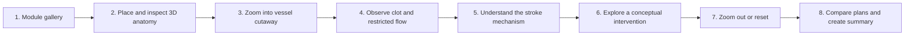
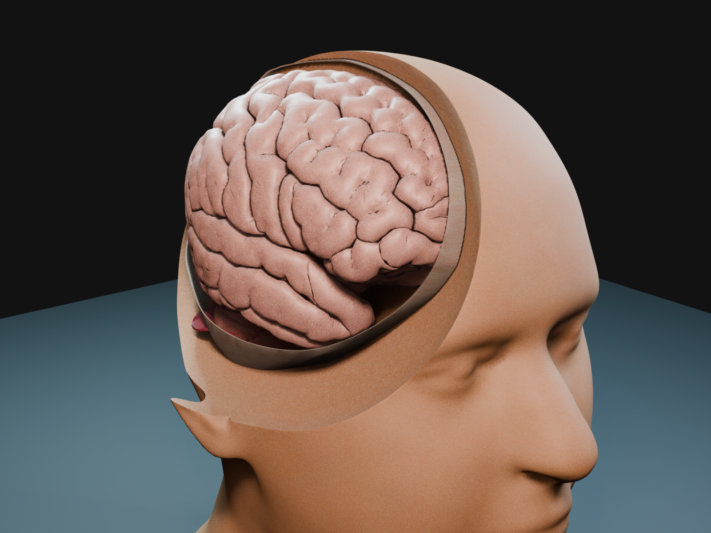
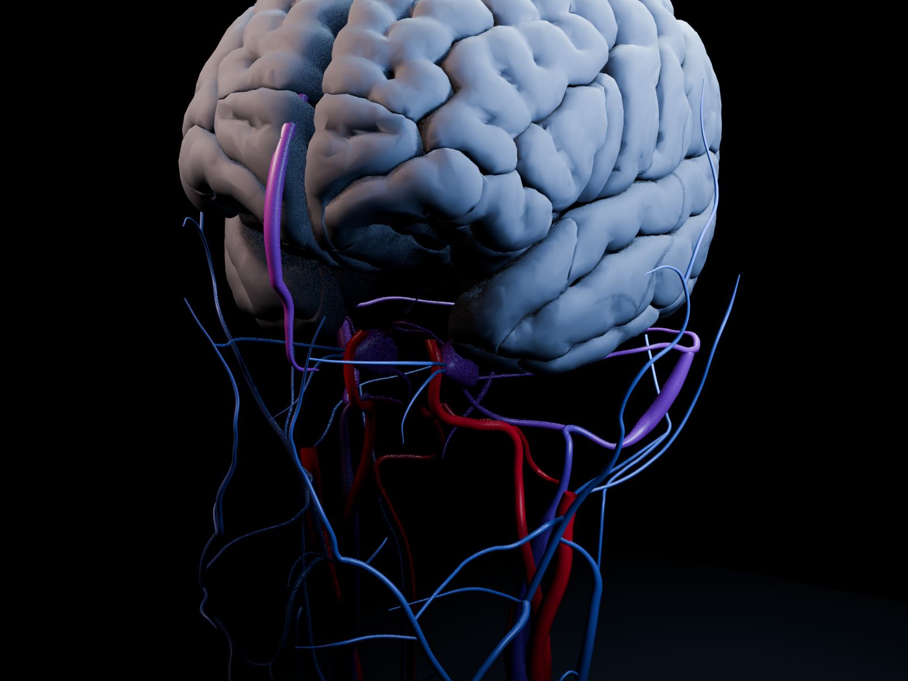

# Stroke VisionOS

An Apple Vision Pro learning experience for exploring how an ischemic stroke can interrupt blood flow, inspecting the affected vessel in 3D, and comparing conceptual response paths in spatial context.

> [!IMPORTANT]
> This repository contains a validated runtime asset catalog and an active
> native visionOS prototype under [`apps/StrokeCare`](apps/StrokeCare). Build,
> Simulator, physical-device, clinical, and human-use evidence remain separate.

## Product promise

Stroke VisionOS should make a difficult biological process understandable through a direct spatial loop:

1. Choose a learning module.
2. Place and inspect a 3D anatomical model.
3. Zoom into a vessel and open a cutaway view.
4. Observe a clot and the resulting restriction in blood flow.
5. Follow the mechanism from obstruction to stroke risk.
6. Explore a conceptual intervention and restored-flow state.
7. Zoom out or reset to regain anatomical context.
8. Compare Plan A and Plan B, then generate a learning summary.



The experience should feel like an interactive spatial lesson, not a static anatomy viewer or a conventional dashboard.

## Safety and evidence boundary

This is an educational prototype. It is not a medical device and must not:

- diagnose, triage, or predict a real person's condition;
- recommend treatment, medication, dosage, or a clinical procedure;
- ingest patient records, scans, identifiers, or other protected health information;
- present simplified visuals or simulation values as clinically exact;
- claim device, simulator, build, scientific, or user-test proof that has not actually been completed.

Educational simplifications must be labelled in the interface and documentation. Scientific or clinical statements should be traceable to reputable sources before release.

### Research library

The draft [open cranial surgery after stroke evidence and communication library](docs/research/open-cranial-stroke-surgery/README.md) maps the major surgical pathways, annotated clinical evidence, urgent-family communication guidance, synthetic conversation demos, and product safety requirements. It is a research foundation for specialist review—not approved patient-specific content, a clinical guideline, or a consent tool.

## MVP scope

The first coherent vertical slice should include:

- a compact module gallery;
- one placeable and rotatable 3D vessel or neurovascular scene;
- zoom, orbit, translation, and a reliable Reset/Home action;
- a reversible cutaway or “unzip” view of the vessel;
- readable clot, restricted-flow, and restored-flow states;
- a short guided sequence connecting the visual change to the learning objective;
- a simple Plan A / Plan B comparison using educational language;
- a local learning summary or report with no patient data.

Not part of the first slice: accounts, cloud sync, clinical decision support, patient-specific simulation, collaboration backends, or production analytics.

## Current 3D asset catalog

The repository includes **65 uniquely named, manifest-backed USDZ runtime
assets**:

- 36 higher-detail v2 assets: brain/skull anatomy, head layers, cranial
  vasculature, cerebral blood-flow teaching views, and generic thrombectomy
  devices;
- 29 clearly labelled low-poly prototype-v1 assets for sequencing and early
  interaction work.

The complete one-by-one catalog, paths, descriptions, runtime notes, manifests,
and loading guidance are in
[`RealityKitContent/Assets/README.md`](RealityKitContent/Assets/README.md).
The canonical scene hierarchy, asset relationships, pathway state machine,
interaction physics, and Houdini/RealityKit handoff are defined in
[`MASTER.md`](MASTER.md).
Licensing and provenance are recorded under [`docs/assets`](docs/assets).





These models are generic educational material—not patient-specific anatomy,
quantitative flow simulation, or clinical decision support.

## Intended Apple stack

The implementation direction is native visionOS:

- **SwiftUI** for windows, navigation, controls, and report surfaces;
- **RealityKit** for spatial anatomy, animation, materials, particles, and interactions;
- **Reality Composer Pro** where authored scene composition is useful;
- **XCTest or Swift Testing** for deterministic logic and state transitions;
- **Apple Vision Pro Simulator** for automated/local build evidence, followed by separate physical-device and human usability checks.

Exact deployment target, Xcode version, project name, scheme, and package choices must be recorded after the initial Xcode scaffold is merged. Do not guess them in code or documentation.

## Repository layout

The first scaffolding pull request may refine this layout, but it should keep feature ownership obvious:

```text
Stroke-VisionOS/
├── apps/StrokeCare/                # Native visionOS communication prototype
├── RealityKitContent/Assets/       # Canonical 65-asset catalog
├── docs/                            # Research, provenance, and review gates
├── MASTER.md                        # Asset relationships and state contract
└── README.md
```

Keep shared transform state—zoom, orbit, translation, cutaway state, and reset behavior—in one explicit experience-state owner. A Reset/Home action must restore the complete spatial view, not only one transform.

## Collaboration model

`main` is the integrated, reviewable branch. Arnav/project lead owns merges to `main`. Everyone else—including coding agents—works on a short-lived branch and opens a pull request.

### Branch names

Use one of these forms:

```text
feature/<name>-<short-scope>
fix/<name>-<short-scope>
asset/<name>-<short-scope>
docs/<name>-<short-scope>
chore/<name>-<short-scope>
```

Examples:

```text
feature/carman-vessel-cutaway
feature/mei-learning-report
asset/jo-neurovascular-model
fix/sam-reset-transform
```

Use lowercase words separated by hyphens. Do not create vague branches such as `updates`, `final`, or `new-version`.

### One-time repository bootstrap

Because the remote repository began empty, the project lead must seed `main` before teammates create branches:

```bash
git add README.md
git commit -m "docs: add project and collaboration guide"
git branch -M main
git push -u origin main
```

The lead should then merge an Xcode scaffolding pull request before feature work fans out. This prevents every teammate from independently creating a conflicting project file.

### Teammate workflow

```bash
# Clone once
git clone https://github.com/Arnie016/Stroke-VisionOS.git
cd Stroke-VisionOS

# Start every task from the latest main
git switch main
git pull --ff-only origin main
git switch -c feature/<your-name>-<short-scope>

# Work, then inspect exactly what changed
git status --short
git diff --check

# Commit and publish only your branch
git add <files-you-intend-to-commit>
git commit -m "feat: describe the user-visible change"
git push -u origin feature/<your-name>-<short-scope>
```

Open a pull request into `main`. Do not push directly to `main`, force-push a shared branch, or merge your own pull request unless the project lead explicitly asks.

### Commit style

Prefer small commits with an intent prefix:

- `feat:` user-visible capability;
- `fix:` defect correction;
- `asset:` model, texture, material, or animation work;
- `test:` verification only;
- `docs:` documentation only;
- `chore:` project configuration or maintenance.

Each commit should represent one understandable change. Avoid mixing feature work, asset replacement, broad formatting, and refactoring in the same commit.

## Workstream ownership

Before editing, claim a workstream in the team chat or GitHub issue. This is especially important for Xcode project files and Reality Composer Pro scenes, which are difficult to merge.

| Workstream | Typical ownership boundary | Example branch |
|---|---|---|
| Project scaffold | Xcode project, targets, packages, signing placeholders | `chore/arnav-project-scaffold` |
| Vessel explorer | Scene placement, transforms, cutaway, Reset/Home | `feature/carman-vessel-cutaway` |
| Flow and clot states | Deterministic lesson states, visuals, transitions | `feature/name-clot-flow-states` |
| Lesson UI | Gallery, step controls, labels, accessibility | `feature/name-guided-lesson-ui` |
| Plans and report | Comparison surface and local learning summary | `feature/name-plan-report` |
| 3D assets | Model cleanup, scale, materials, provenance | `asset/name-neurovascular-model` |
| Verification | Unit tests, contract checks, build instructions | `test/name-experience-contract` |

If another branch owns the same scene or project file, coordinate before editing it. Prefer additive files and narrow changes over unrelated project-wide rewrites.

## 3D asset rules

- Agree on metres, origin, forward axis, pivot, and naming before importing assets.
- Prefer formats supported by the agreed RealityKit pipeline; keep editable sources separate from runtime exports.
- Record source URL or creator, licence, required attribution, modifications, scale, and export settings in `docs/assets/`.
- Configure Git LFS before committing large binary assets. Do not repeatedly replace large binaries in normal Git history.
- Do not commit assets with unclear rights, patient-derived data, secrets, API tokens, signing files, or private exports.
- Optimise geometry and textures deliberately; visual fidelity does not excuse an unusable frame rate.

## Pull request contract

Every pull request should answer:

1. **What changed?** Describe the user-visible behavior and list the main files.
2. **Why this scope?** Link the issue, task, or agreed workstream.
3. **How was it verified?** Include the exact command, simulator/device, and result.
4. **What remains unverified?** Call out device, hand tracking, performance, scientific review, or accessibility gates literally.
5. **What should reviewers look at?** Include screenshots or a short capture for visual/spatial work when available.

Checklist:

- [ ] Branch started from current `main`.
- [ ] Change stays inside the claimed workstream.
- [ ] `git diff --check` passes.
- [ ] The narrowest relevant tests/build were run and reported exactly.
- [ ] Reset/Home still restores every spatial transform affected by the change.
- [ ] Educational approximations and medical boundaries remain clear.
- [ ] New assets have provenance, licence, scale, and attribution records.
- [ ] No secrets, personal data, signing credentials, or generated build folders are included.
- [ ] Documentation matches the code that actually exists.

## Definition of done

A feature is done only when:

- its intended interaction works through the complete local loop;
- empty, loading, failure, and reset behavior are handled where relevant;
- labels remain readable and controls remain usable in the intended spatial context;
- deterministic state logic has a narrow test where practical;
- the app builds using the repository's documented command;
- the pull request records what was and was not tested;
- the work is reviewed and merged by the project lead.

A successful simulator build is not physical Vision Pro proof. A rendered animation is not scientific validation. A merged feature is not a clinical claim.

## Instructions for coding agents

When this repository URL is given to a coding agent, use the following contract:

```text
Read README.md completely before making changes.

1. Inspect git status, the current branch, and the actual repository contents.
2. Treat roadmap and proposed-architecture text as intent, not implemented fact.
3. Start from current main and create one short-lived branch for one bounded task.
4. Do not overwrite unrelated teammate work or broadly rewrite project files.
5. Keep the app native to visionOS unless the task explicitly changes that decision.
6. Preserve the educational/non-diagnostic boundary and never add patient data.
7. Do not add secrets, personal signing settings, paid services, or unlicensed assets.
8. Run the narrowest relevant verifier and report its exact result.
9. Do not push to main or merge. Push only the assigned branch if explicitly asked.
10. End with: changed files, verification, remaining blocker, and one next safe action.

If required context is missing and guessing would change architecture, medical meaning,
asset licensing, or another teammate's workstream, stop and ask the project lead.
```

Suggested task prompt:

```text
Work on <one bounded outcome> in https://github.com/Arnie016/Stroke-VisionOS.
Follow README.md and create <branch-name> from current main. Own only <files/workstream>.
Do not push to main or merge. Verify with <expected check>. Return changed files,
the exact verification result, the nearest blocker, and one next safe action.
```

## Build and verification status

The asset catalog has package-level USD/RealityKit validation documented in
[`docs/assets/VALIDATION.md`](docs/assets/VALIDATION.md). No Xcode project or
repository-owned app build command exists yet. The scaffolding pull request must
replace this section with:

- required macOS and Xcode versions;
- visionOS deployment target;
- project/workspace name and scheme;
- package or asset setup steps;
- exact simulator build command;
- exact test command;
- known physical-device and human-test gaps.

Until then, do not report `BUILD SUCCEEDED`, simulator support, device support, or completed interactions for this repository.

## Merge and conflict recovery

Before requesting review:

```bash
git fetch origin
git rebase origin/main
git diff --check origin/main...HEAD
```

If rebase conflicts touch another person's scene, Xcode project settings, or binary asset, stop and coordinate with that owner. Do not resolve a conflict by deleting their work or choosing an entire side blindly.

## Project decisions still to lock

- exact scientific learning objective and audience;
- anatomical model source and licence;
- visual language for clot, restricted flow, and restored flow;
- meaning and wording of Plan A / Plan B;
- whether the report is an on-screen recap, export, or both;
- minimum supported visionOS/Xcode versions;
- simulator performance budget and physical-device test plan;
- accessibility and reduced-motion behavior;
- repository licence.

Record accepted decisions in the repository so teammates and agents share the same source of truth. Chat messages and sketches are inputs; merged documentation and code are the canonical project record.

## Licence

No licence has been added yet. Do not assume that the code or assets may be redistributed outside the project team until the project lead adds an explicit licence.
