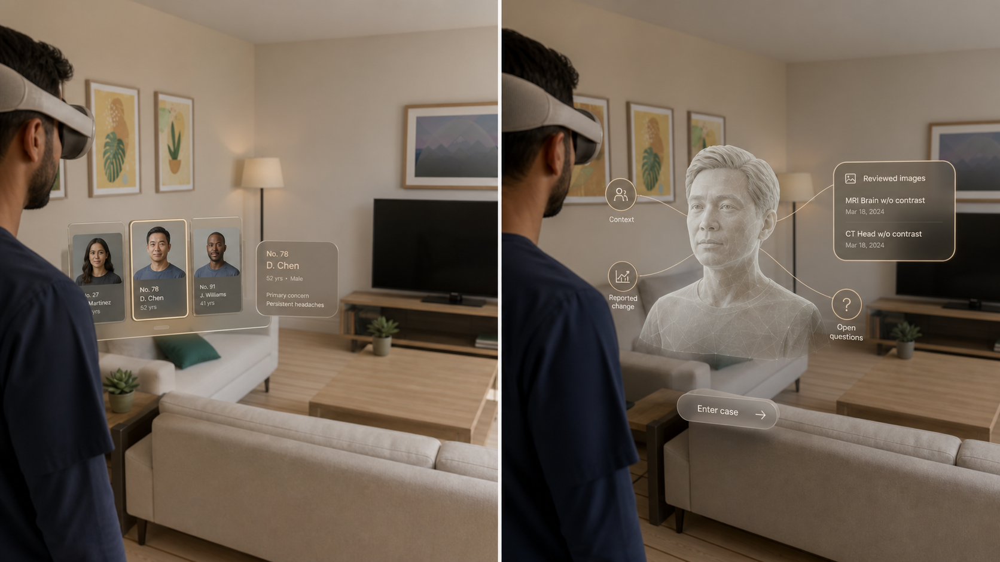

# Case intake visual target

This image is a **design target, not runtime proof**. It translates the Page 2
Figma choreography and team discussion into one implementation contract:

1. The doctor begins with one shallow, peripheral rail of fictional dossiers.
   The centre of the room stays empty.
2. Gaze supplies native hover emphasis; pinch selects. No raw eye data, wave
   inference, or custom hand-tracking permission is required.
3. The selected dossier steps forward and shows only case number, age band,
   and one explicitly authored concern.
4. Selection dissolves into a licensed or otherwise reviewed neutral patient
   representation. Four nearby filaments reveal context, reported change,
   reviewed images, and open questions.
5. Only one node expands at a time. **Enter case** is the explicit threshold
   that removes intake furniture and introduces anatomy.

The current Simulator implementation proves the transition grammar with a
procedural neutral anchor in `Proof/69-case-history-unfold-simulator.png`. It
does not yet meet the realistic, diverse three-person representation shown
here. Any replacement must pass provenance, license, likeness, diversity,
export, performance, and accessibility review before it is bundled.

Image SHA-256:
`09bd147717bd63d8fbfed1199c412395279a6f6367c7616a6bcbc12065885c0a`.
