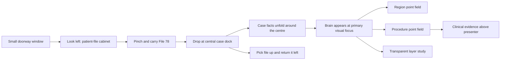

# Stroke Care product and spatial UI map

## Product promise

Stroke Care turns one fictional stroke case into a shared spatial explanation.
The family and clinician handle the same case object, look at the same anatomy,
and move through one visual change at a time. The product is not a notes app, a
patient record, a scan viewer, or a treatment decision aid.

## Core spatial choreography

The interaction borrows the useful spatial principle of a visionOS DJ deck:
the library is left, the working object is centre, the precision controls are
right, and finished material returns to its origin. The user turns their head
and carries an object; they do not navigate a stack of desktop pages.

## Room map

| Zone | Object | Why it occupies that space | Current interaction |
| --- | --- | --- | --- |
| Left peripheral | Physical case cabinet and archived files | Browsable library; present but not demanding | Gaze + pinch File 78 |
| Centre near-field | Empty circular case dock | Makes the user's next action self-evident | Carry and drop file |
| Centre foveal | Brain, arteries, clot, affected territory | The shared explanatory object | Gaze, select, orbit, magnify |
| Around anatomy | Case facts or selected annotation | Context stays close to what it explains | Progressive reveal; point selection |
| Top spatial spine | Head → brain → artery → clot / pressure space | Orientation without another bottom strip | Changes with the current act |
| Right secondary | Compact presenter rail | Precision controls without covering the shared model | Act, layer, field, evidence, pause |
| Upper evidence plane | Clinical evidence | Sources sit above, outside the family explanation | Search, pin, open, compose draft |

## State-by-state UI map

### 0. Doorway

The only conventional window is a small system-required threshold: **Family**
or **Presenter**, then “Enter the case room.” It carries no patient cards,
notes, dashboard, or anatomy controls.

### 1. Spatial patient cabinet

- The cabinet is a RealityKit object at the user's left.
- The gold folder is a direct/indirect input target with collision and hover.
- The centre dock is deliberately empty.
- The anatomy is hidden until the file reaches the dock.
- Dragging away and releasing returns the file to the cabinet.

Current limitation: this is a functional geometric prototype, not the final
high-resolution cabinet. Folder labels, materials, hinges, file fan-out, and
return animation still need a technical-art pass and XCAT hand testing.

### 2. Docked case and patient facts

- Dropping the file makes the brain the central shared object.
- Speech, arm, time, and open-question facts become separate spatial artifacts,
  not tiny tabs inside a notes window.
- The file remains a physical object beneath the anatomy and can be returned.
- The cabinet stays left as the persistent source library.

Current limitation: the fact artifacts need stronger relationship lines,
larger typographic treatment, and a better orbit around the case. They are
implemented, but this visual pass is not the final design.

### 3. Region exploration

- Cyan points are derived from the registered cortex bounds.
- A point remains parented to the cortex and follows orbit/magnification.
- Gaze + pinch selects a point; dragging from it rotates the entire anatomy.
- The point cannot be detached, preventing loss of anatomical meaning.
- Only the selected point receives a text label.

### 4. Procedure path

- Amber points form a separate ordered reference field along the vessel path.
- Switching field changes the meaning of the points; it does not add a second
  simultaneous layer of labels.
- The selected **Occlusion focus** is the only expanded annotation.
- The sequence is clinician-reviewed teaching choreography, not a simulated
  catheter plan or patient-specific trajectory.

### 5. Transparent anatomy

- Cortex opacity changes while arteries and the teaching clot stay registered.
- The result is reversible and non-graphic.
- **Study apart** uses small wrapper offsets; no child asset transform is
  rewritten.
- The language is “fade one layer” and “room, not repair”—never peel, unzip,
  cut, drill, or blood.

### 6. Clinical evidence

- Evidence opens above the presenter, not over the patient's central brain.
- A source includes full citation, link, support, and limitation.
- Pinning and source-bound drafting are clinician-only.
- Generated wording remains a draft until clinical review.

## Annotation engineering contract

Every annotation must answer all six fields before it is allowed into the
scene:

| Field | Required answer |
| --- | --- |
| Intent | What question does this help the family or clinician answer? |
| Anatomical anchor | Which entity and local 3D position owns it? |
| Role | Family, clinician, or both? |
| Reveal condition | What deliberate action makes it visible? |
| Visual response | Focus, transparency, flow cue, or layer change? |
| Evidence | Which reviewed source supports it, or what review is pending? |

An annotation is not a permanent label. It starts as a quiet point, expands
only after selection, stays at the object's depth, and collapses when cleared.
Safety, uncertainty, and exit controls are never communicated only in
peripheral vision.

## Control and agency map

| Gesture/action | Result | Reversibility |
| --- | --- | --- |
| Gaze + pinch case file | Acquire physical case object | Release away from dock returns it |
| Carry file to centre | Reveal case and anatomy | Carry file back left |
| Gaze + pinch anatomy point | Select one intended question | Clear selection |
| Drag selected point or brain | Orbit complete registered anatomy | Reset view |
| Two-hand magnify | Scale complete registered anatomy | Reset view |
| Choose Regions / Procedure | Swap point-field meaning | Swap back; points remain registered |
| See through | Change cortex opacity | Return to Layers |
| Study apart | Apply small semantic-layer offsets | Return to Layers without drift |
| Pin source | Preserve evidence in clinician space | Unpin |

## Patient and presenter split

**Family** sees the shared brain, one calm sentence, pause, clarification, and
point-on-brain actions. It does not see surgical tools, evidence drafting, or
procedure precision controls.

**Presenter** receives the secondary rail only after the case is docked. Its
compact menus change act, layer presentation, and point-field flavor. The rail
is not the product's primary surface; the anatomy remains the centre of action.

## Implementation map

| Product area | Source of truth |
| --- | --- |
| Shared state, file docking, proof states | `Sources/StrokeExperienceState.swift` |
| Cabinet, file, dock, anatomy, point entities | `Sources/StrokeSceneFactory.swift` |
| Room placement, attachments, gestures, role rail | `Sources/StrokeImmersiveView.swift` |
| Minimal entry threshold and deterministic routes | `Sources/StrokeJourneyLaunchView.swift` |
| Evidence source workspace | `Sources/StrokeEvidenceWorkspaceView.swift` |
| Runtime scenes and placement | `Sources/StrokeTimeApp.swift` |
| Blender semantic USD authoring | `Scripts/build_blender_layer_study.py` |
| DCC authority and handoff | `Docs/DCC_LAYER_STUDY_PIPELINE.md` |

## Evidence status

- Static Stroke Care contract: **PASS**.
- visionOS Simulator build: **PASS**.
- Blender 5.2 semantic layer study: **PASS** with a versioned manifest.
- Simulator screenshots: layout/render evidence only.
- Direct hand carry, gaze targeting, binocular depth, comfort, and legibility
  on XCAT: **NOT PROVEN**.
- Clinical correctness and acceptability: **PENDING SPECIALIST REVIEW**.
- Houdini and Unreal execution: **NOT RUN**; neither editor is installed here.

The current improvement is architectural: the app now has a spatial object
loop. The next visual pass should refine cabinet/folder craft, make the top
spine unmistakable, add elegant provenance threads, and reduce the presenter
rail further after XCAT hand testing.
