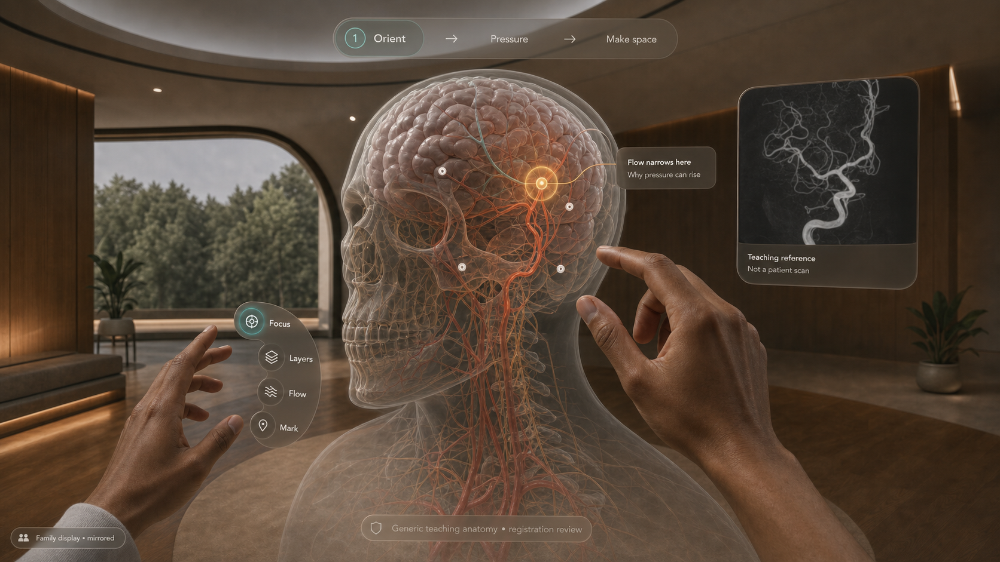

# Stroke Care visual direction

## Selected-point anatomy target

This is the intended explanation composition: the registered anatomy owns the
centre, the top timeline remains revisitable, and only quiet anatomy-attached
points are visible before selection. Selecting one point reveals one local
lesson or reviewed procedure explanation at the same depth. The right reference
object changes with the selected act; it is teaching imagery, never an inferred
patient scan. This is a design target, not an implementation or clinical proof.

The Scholar skull inspection is deliberately separate. It isolates the existing
generic cross-source skull for shape review and labels its registration as
specialist-review pending; it never presents that skull as exact patient anatomy.

## Journey storyboard

This generated storyboard is a design target, not implementation, device,
wearer, comprehension, or clinical proof. It is deliberately brighter and more
legible than the current engineering capture.

## Six-frame journey

1. **Threshold** — the clinician wears Apple Vision Pro; the family sees a
   family-safe composition on Apple TV or a room display.
2. **Case rail** — one tilted, effectively infinite rail presents short fictional
   case summaries. The centre stays empty until selection.
3. **Case constellation** — one selected fictional person unfolds into a compact
   history, relationship, imaging, and timing web; returning the dossier closes it.
4. **Shared anatomy** — the registered skull/brain/vessel object owns the centre.
   The persistent top timeline is **Orient → Pressure → Make space**. Quiet,
   anatomy-attached points replace permanent label clutter; selecting one opens
   its single lesson or reviewed procedure explanation.
5. **Family composition** — the mirrored view exposes only Point, Circle,
   Question, pause, and reviewed step-specific imagery. It never exposes graphic
   surgical props or private presenter controls.
6. **Detail** — Calm / Guided / Scholar is a separate, clearly labelled density
   control in the presenter periphery. Scholar can open one conceptual,
   not-to-scale vessel aperture and one source object without replacing the
   three-act timeline.

## Interaction contract

- Gaze supplies standard system focus; pinch confirms. The app does not receive
  or store raw gaze coordinates.
- A selected point may brighten or expand slightly, but its annotation remains
  attached to the relevant anatomy at the same depth.
- The clinician hand arc is limited to **Focus · Layers · Flow · Mark** with a
  conventional side-rail fallback. Procedural tools remain in a separately
  labelled clinician-review prototype and cannot mutate anatomy.
- A family question marker must open or reveal its associated question; an
  inert floating question mark is a defect, not a feature.
- Later timeline comparison may pair two explicitly selected acts. It must not
  imply a before/after cure, treatment recommendation, or automated outcome.

## Current proof boundary

The post-fix Simulator route in
`Proof/54-simulator-authored-frame-pressure.png` demonstrates that the authored
stage, brain, top timeline, and attachments render after disabling unstable
Simulator-only device-anchor relocation. It does not prove the storyboard's
final composition, Apple TV mirroring, XCAT comfort, point accuracy, hand reach,
accessibility, family comprehension, or clinical validity.
