# Stroke Care

A clinician-paced visionOS explanation that uses spatial change—not a dashboard—to
tell one difficult story in three visual acts:

1. **Orient** — a whole brain rests inside a fixed skull while vessels supply it.
2. **Pressure** — a blockage and affected tissue appear; the affected side swells
   slightly while the skull stays fixed.
3. **Make space** — after explicit permission, a non-graphic bone-flap and dural
   expansion view explains mechanical purpose without implying that established
   injury is restored.

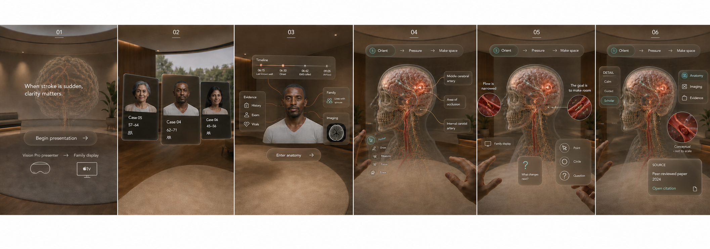

This image is the **visual-direction target**, not a Simulator or XCAT receipt.
Its full role, timeline, point-selection, mirrored-family-display, and Scholar
boundaries are specified in [Docs/VISUAL_DIRECTION.md](Docs/VISUAL_DIRECTION.md).

The selected-point hero direction is also captured in
[Docs/VISUAL_DIRECTION.md](Docs/VISUAL_DIRECTION.md): the default anatomy view
starts with attached points rather than a permanent label cloud, and a single
selection reveals one local explanation plus the relevant teaching image.

## Latest verified Simulator composition

Build `0.6 (17)` makes the Pressure story visually explicit without adding a
diagnostic overlay. The registered clot keeps a compact pulse; a filled amber
surface cue marks affected tissue; and a wider dashed mint boundary represents
constrained swelling. All three cues are derived from the loaded registered-v2
brain/clot bounds, remain qualitative, and disappear outside Pressure / Make
space. The prototype-v1 edema, flap, and patch meshes remain quarantined.

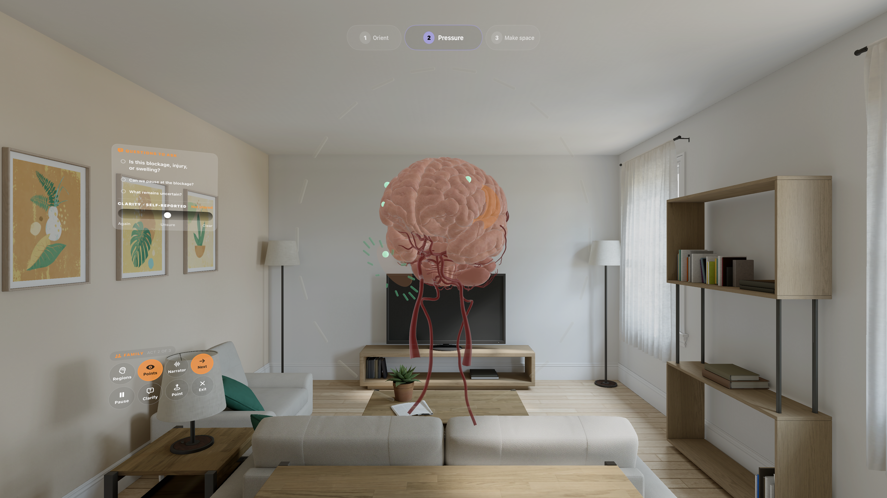

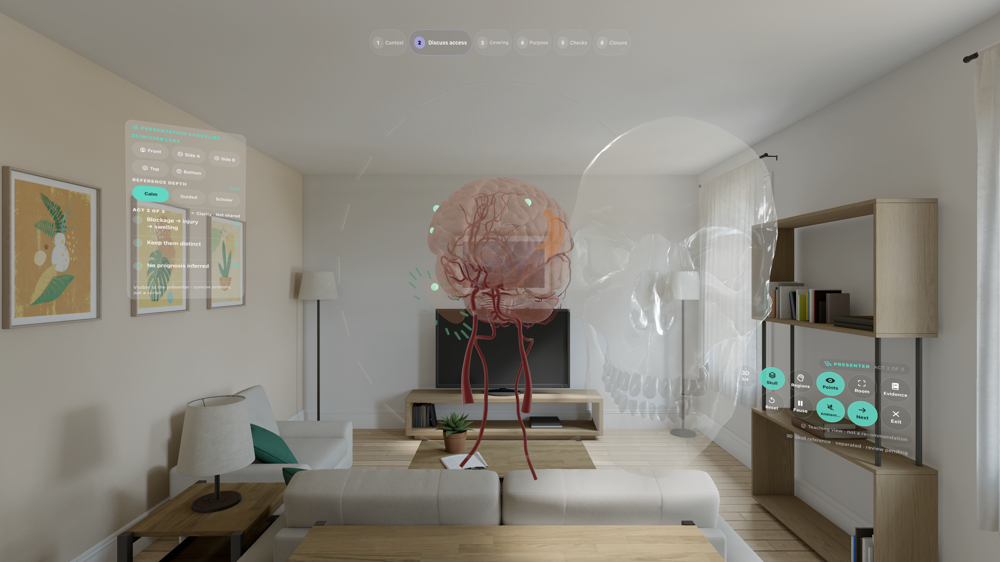

These captures prove the build-17 Simulator render/process state only. They do
not prove anatomical meaning, clinical correctness, gaze-and-pinch quality,
stereo depth, AirPlay legibility, wearer comfort, or family comprehension.

The room-scale intake and Pressure scenes now have a fresh-build regression
gate. The visionOS Simulator stays in the authored eye-height frame instead of
accepting its unstable zero device pose. `Scripts/capture_simulator_route_proof.zsh`
installs the exact app bundle, terminates known competing immersive apps,
launches either `--proof-spatial-intake` or `--proof-pressure`, verifies the
process before and after capture, and rejects undersized, near-uniform,
empty-centre, or colourless-centre screenshots.

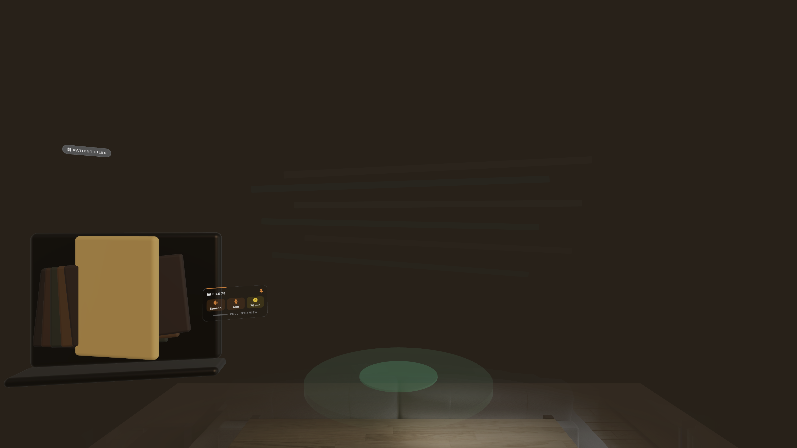

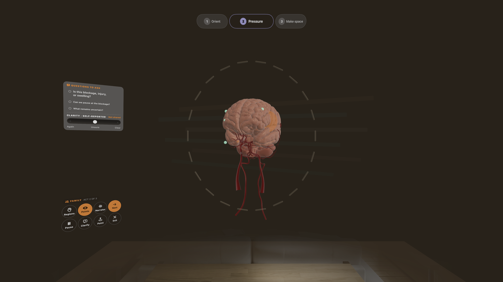

These two captures prove current Simulator render/process state only. They do
not prove physical placement, gaze-and-pinch quality, comfort, AirPlay
legibility, comprehension, or clinical validity.

Build `0.6 (17)` retains brain, arteries, clot, and dura as one required
registered-v2 teaching set. If any required layer is missing or fails to load,
Stroke Care logs the exact asset name and shows the complete procedural model
with a visible **Simplified teaching view · Detailed anatomy unavailable**
boundary. It no longer suppresses the fallback and silently presents a partial
head. Optional skull, venous, internal-detail, and flow references remain
independently gated.

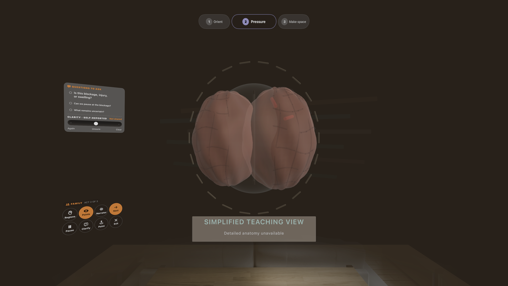

Build `0.6 (15)` adds a same-frame, registered-v2 Circle-of-Willis teaching
overlay to the deliberately selected Blood-flow point. Coral/gold route lines
and authored direction chevrons stay attached to the central arterial model;
the adjacent teaching caption states that the cue is qualitative and **not
CFD**. It is hidden until a point is selected and does not claim patient flow,
velocity, perfusion, collateral circulation, or treatment effect.

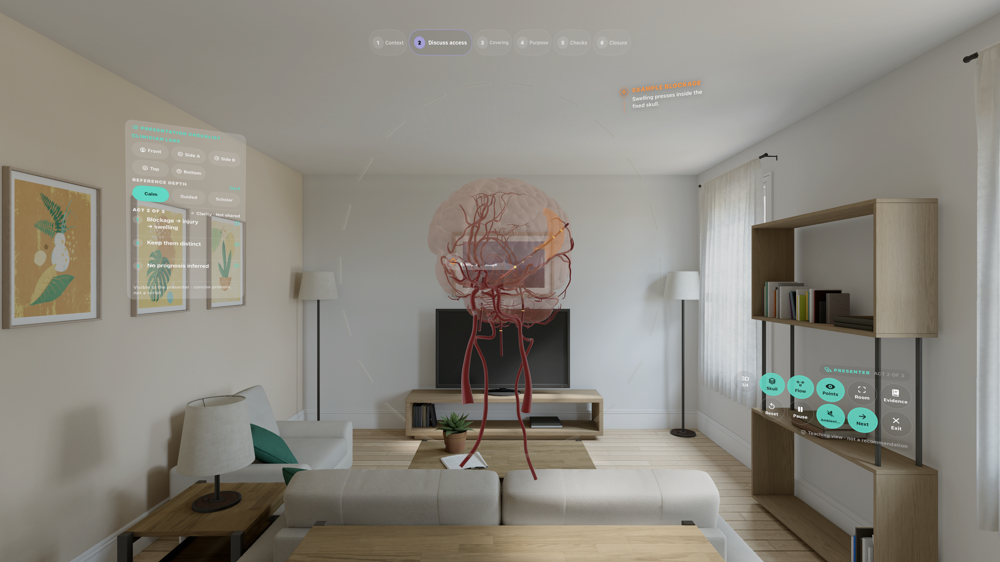

Doctor-presenter mode now maps the Page 2 procedure story into six compact,
revisitable checkpoints: **Confirm context**, **Discuss access**, **Protective
covering**, **Explain purpose**, **Team checks**, and **Explain closure**. The
patient/family path remains the simpler three-act story. Checkpoints 3–6 retain
the explicit permission gate, and the final checkpoint reassembles the teaching
layers without presenting an operative success state.

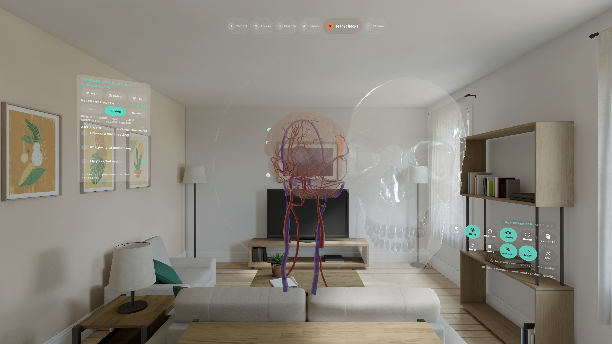

This is a screenshot-derived implementation of the supplied Figma Page 2
frames; Figma MCP structured-context access was rate-limited, so 1:1 Figma
validation remains pending.

The first frame is the quiet Pressure overview: registered-v2 brain and
arteries, a clot-derived focus beacon, four anatomy-attached lesson points, and
the revisitable three-act timeline. No label or secondary reference opens until
the presenter selects a point.

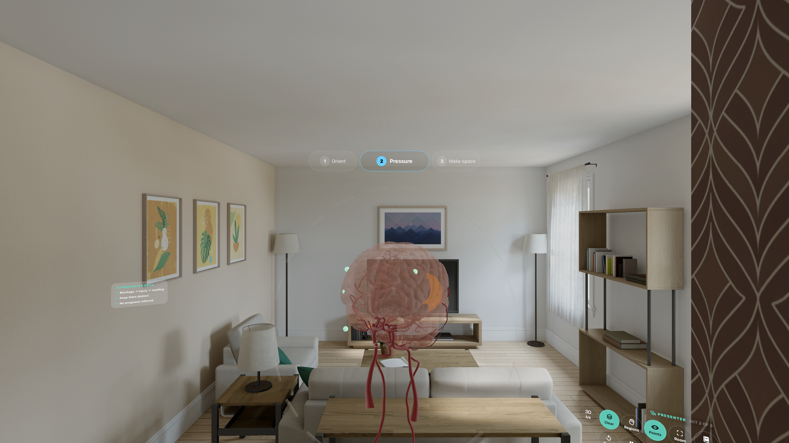

The second frame is the selected-point state: one point gains one local label,
one concise explanation, and one registered affected-vessel reference at the
right. It is not a patient scan and remains clinical-review pending.

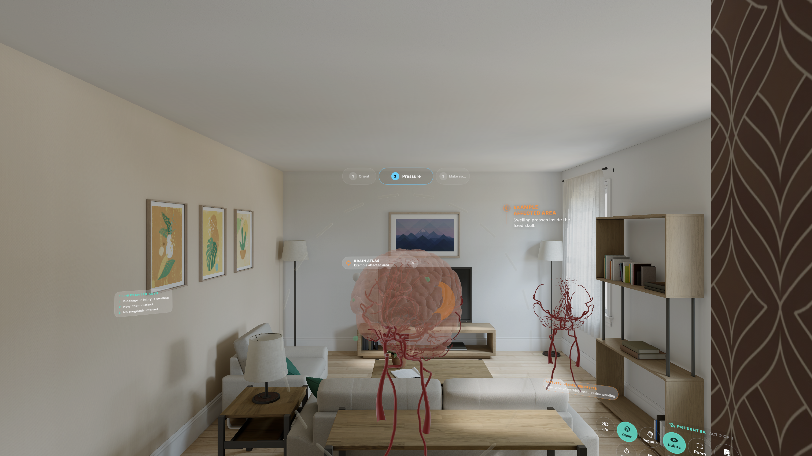

These are fresh visionOS Simulator runtime captures, not concept art. They do
not prove physical XCAT depth, gaze-and-pinch reliability, wearer comfort,
family comprehension, or clinical validity.

For the showcase, one doctor wears XCAT and the family watches the mirrored
view on a Mac or Apple TV. This build does not claim a second-headset or shared
spatial session. Three finite question prompts and an explicit, self-reported
clarity check remain in the left family field; the clinician sees only that
shared response beside three concise presenter cues. No anxiety, emotion, or
physiology is inferred.

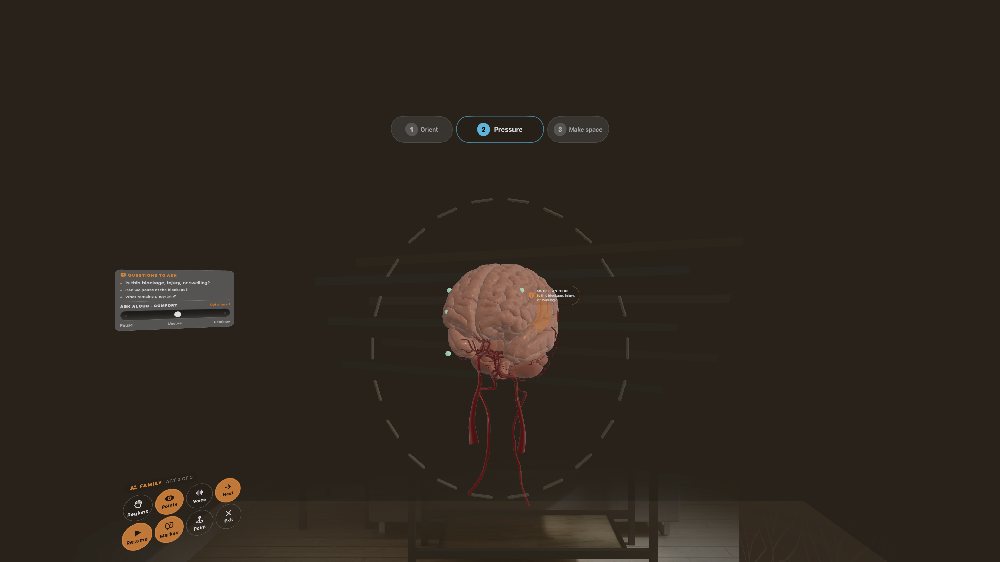

The clinician's existing layer control can also separate the generic skull to
the right while preserving the detailed central brain, vessels, point field,
and timeline. The separation is deliberate: a transparent overlap hid cortex
detail and could imply an exact cross-source fit that has not been reviewed.

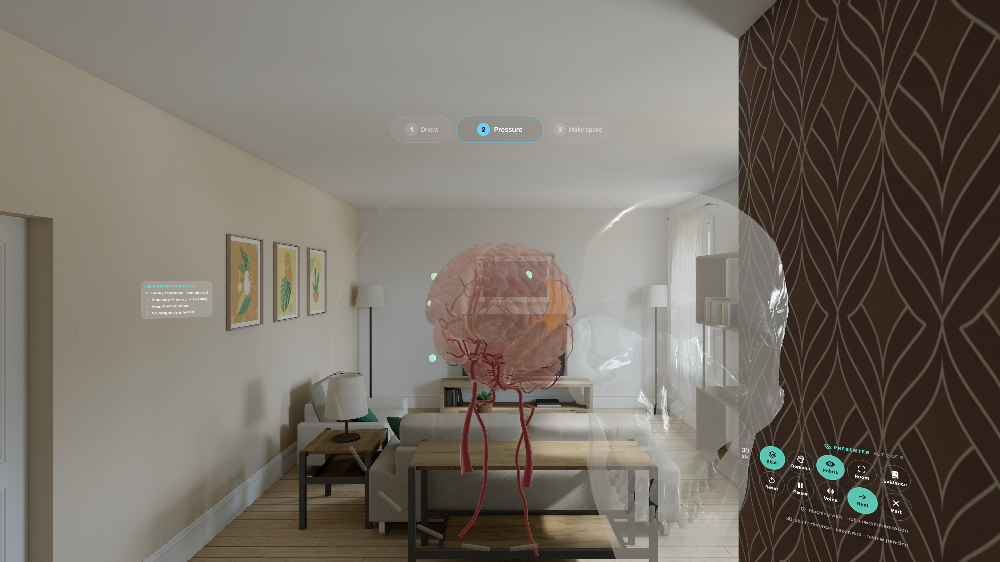

The launch window begins with a two-beat calm prelude, then asks whether the
purpose is **Patient / family** or **Doctor presenter**. The patient/family path
enters the calm generic anatomy exhibit directly; the doctor path opens the
fictional case library before the shared brain. Inside the immersive
space, the file itself is the control: carrying it from the exhibit into the
centre opens a distinct case-review constellation. The wearer must explicitly
enter the selected case before the complete intake room disappears and the
brain appears. Patient-file furniture never persists beside the anatomy.

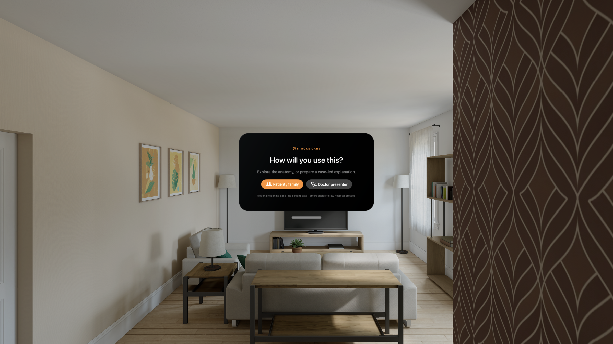

The doctor's left peripheral surface is a Page 2-inspired presentation
checklist—not a note editor. It shows three current-act prompts, the explicitly
shared clarity state, and the boundary that these are prompts rather than a
script. Pinching one technical prompt reveals one authored plain-language line;
it does not call a generative medical-answer endpoint.

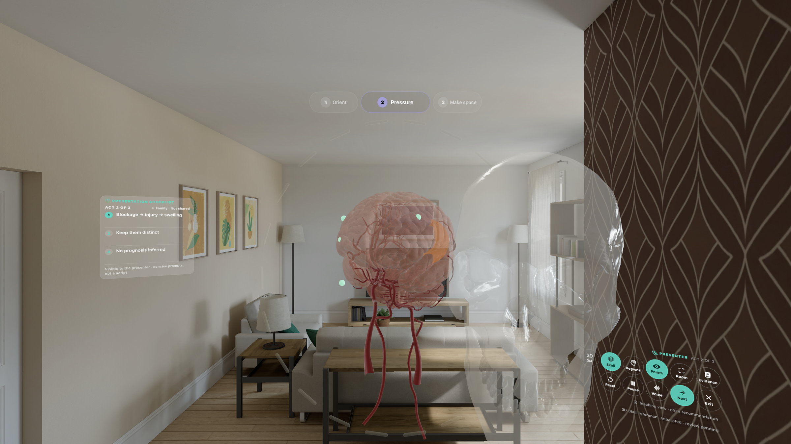

The role contract is now explicit: the family may opt into the locked
`gpt-realtime-2.1` narration path, while the doctor-presenter route has no
synthetic voice control. Pause silences narration. Family questions are finite
pause markers, not a microphone or listening loop.


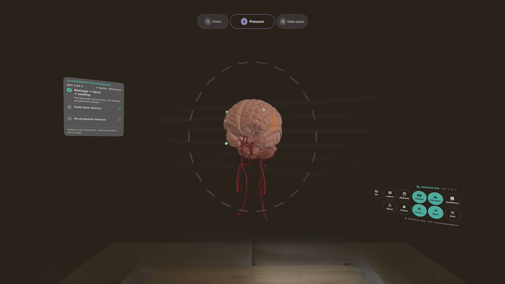

The companion window has two views over the same spatial state:

- **Family** keeps one calm sentence plus only pause and clarification controls.
  It does not expose clinician progression or reset controls.
- **Presenter** exposes direct act targeting, the visible anatomy layers, and a
  concise wording boundary. It never bypasses the permission gate or supplies a
  treatment script.

Both roles can switch between two sparse lesson fields (`Brain regions` and
`Blood flow`). The blood-flow lesson adds quiet directional chevrons on the
same centreline as the vessel droplets. Presenter mode can also open a separate upper evidence window. The
evidence window exposes full citations, stable source links, support/limitation
context, pinning, and a deterministic source-bound teaching draft. It is hidden
from family mode and remains **clinical review pending**.

The clinician layer study adds three reversible presentations: assembled
**Layers**, adjustable **See through**, and a gently offset **Study apart**
view. A selected point stays attached to its anatomical parent and becomes a
handle for orbit and magnification of the whole registered model; markers never
tear away from the brain.

## Spatial rig

- The default immersive path loads the exact PR #2 registered-v2 brain,
  cerebral arteries, right-M1 teaching marker, conceptual dura, semantic skull,
  deep structures, ventricles, and conceptual cerebral-flow animation from the
  canonical repository asset catalog. The app declares a bounded **15-USDZ**
  slice: ten registered-v2 anatomy/teaching files, three quarantined v1 files,
  and two presenter-only tool files. The wider audited GitHub catalog contains
  134 manifest-backed candidates; they are not all loaded into one scene.
  Authored child transforms are not
  rewritten; one outer placement root owns orbit, zoom, and the initial
  three-quarter presentation.
- Deep structures and ventricles appear only in the clinician's explicit
  **Study apart** view. The baked flow asset appears only in the clinician's
  **Blood flow** lesson and freezes with Pause or Reduce Motion. It is generic,
  qualitative authored motion—not CFD, perfusion, velocity, or a patient scan.
- The registered-v2 dural-sinus/jugular reference appears only for a clinician
  who deliberately selects Guided or Scholar detail. Its blue/purple treatment
  is an educational display convention—not venous blood colour, oxygenation,
  direction, velocity, or patient-specific imaging—and specialist review is
  still pending.
- The clinician lens exposes direct `Front`, `Side A`, `Side B`, `Top`, and
  `Bottom` model-frame views in a compact two-row grid. Each preset rotates the
  complete registered assembly as one object; it never independently moves an
  organ, vessel, skull layer, or lesson point. Side labels remain neutral until
  laterality is reviewed.
- Procedural hemispheres, vessels, clot, at-risk tissue, and flow remain an
  instant-loading fallback when the hero brain cannot load.
- A sparse fixed-space boundary ring replaces the earlier dark transparent
  skull bubble once the imported anatomy is present.
- The prototype-v1 edema, bone-flap, and patch files are bundled for a future
  Blender/Houdini registration pass but quarantined from the patient path.
  They must not be overlaid on v2 anatomy until the fit is reviewed.
- Downstream droplets become a fixed residual cue after the occlusion. This is
  qualitative animation, not CFD or a collateral-flow estimate.
- Quiet mono audio beds are anchored separately to the vessel and affected
  hemisphere. Their mix follows the visible act; it never responds to inferred
  emotion, gaze, voice, heart rate, or a patient measurement.
- Family-only optional narration sends only the exact, versioned family caption to a
  developer-controlled proxy for `gpt-realtime-2.1`. The permanent OpenAI key
  remains server-side. There is no system-speech fallback, patient data, or
  generative medical answer in the client. Selecting Doctor presenter revokes
  narration, and Pause stops any active playback.
- For Simulator development, start the loopback-only proxy with
  `Scripts/run_realtime_proxy.zsh`, then launch with
  `STROKE_REALTIME_PROXY_URL=http://127.0.0.1:8791/narrate`. The proxy rejects
  every other model, converts the Realtime API's 24 kHz PCM stream to WAV, and
  never returns the API key to visionOS. `marin` is the locked output voice
  inside `gpt-realtime-2.1`; it is not a macOS system voice.
- A presenter-only spatial bubble switches between native mixed Surroundings,
  the default progressive Warm horizon, and a full-immersion Focus field.
  The setting is reversible and independent of anatomy, pathology, and audio;
  no mode is presented as a therapeutic intervention.
- Tap the occlusion to focus it. Pause, back, mute, exit, and all progression are
  explicit user or clinician actions. There is no success animation.
- A compact spatial patient drawer, selection-only point callout, and family
  question marker move the explanation into the room. The side rails carry
  controls and safety boundaries rather than repeating the lesson as text.

## Clinical and privacy boundary

The app uses `CASE-078`, a fictional scenario with no name, image, medical
record, or real person. It is educational communication support—not a scan,
diagnosis, emergency instruction, consent form, treatment recommendation,
eligibility calculator, clinical decision aid, or medical record.

The current wording is source-aligned to the American Heart Association's 2026
acute ischemic stroke materials and the team's merged open cranial stroke surgery
research, but remains **clinician review pending**. It does not establish whether
decompressive surgery, thrombolysis, thrombectomy, or any other intervention is
appropriate for a person.

The screenshot-derived six-beat Figma translation and its safety gates are in
[`Docs/CRANIOTOMY_TEACHING_SEQUENCE.md`](Docs/CRANIOTOMY_TEACHING_SEQUENCE.md).

- [2026 AHA/ASA acute ischemic stroke guideline hub](https://professional.heart.org/en/science-news/2026-guideline-for-the-early-management-of-patients-with-acute-ischemic-stroke)
- [AHA key patient messages](https://professional.heart.org/en/-/media/PHD-Files-2/Science-News/k/Key-Patient-Messages-The-2026-Acute-Ischemic-Stroke-Guideline.pdf)
- [NICE NG128 recommendations](https://www.nice.org.uk/guidance/ng128/chapter/recommendations)
- [NICE decompressive hemicraniectomy decision-aid guide](https://www.nice.org.uk/guidance/ng128/resources/decompressive-hemicraniectomy-surgery-patient-decision-aid-user-guide-pdf-6775901391)

## Build and proof

```bash
cd apps/StrokeCare
xcodegen generate
xcodebuild -project StrokeTime.xcodeproj -scheme StrokeTime \
  -sdk xrsimulator \
  -destination 'platform=visionOS Simulator,id=F8B7E8FD-DBF2-4270-A6FD-2BA02CD6F777' \
  CODE_SIGNING_ALLOWED=NO build
python3 Tests/verify_contract.py
```

Deterministic Simulator routes:

```bash
# Fresh-install, current-process, nonblank visual regression receipts
Scripts/capture_simulator_route_proof.zsh \
  F8B7E8FD-DBF2-4270-A6FD-2BA02CD6F777 \
  /path/to/StrokeTime.app \
  --proof-spatial-intake \
  Proof/current-intake.png

Scripts/capture_simulator_route_proof.zsh \
  F8B7E8FD-DBF2-4270-A6FD-2BA02CD6F777 \
  /path/to/StrokeTime.app \
  --proof-pressure \
  Proof/current-pressure.png

xcrun simctl launch --terminate-running-process \
  F8B7E8FD-DBF2-4270-A6FD-2BA02CD6F777 \
  com.arnav.StrokeTime --hackathon-demo

# With Scripts/run_realtime_proxy.zsh already running:
SIMCTL_CHILD_STROKE_REALTIME_PROXY_URL=http://127.0.0.1:8791/narrate \
  xcrun simctl launch --terminate-running-process \
  F8B7E8FD-DBF2-4270-A6FD-2BA02CD6F777 \
  com.arnav.StrokeTime --proof-realtime-narration

# Patient pressure/care states and clinician presentation state
... com.arnav.StrokeTime --proof-pressure
... com.arnav.StrokeTime --proof-care-purpose
... com.arnav.StrokeTime --proof-clinician-pressure

# Integrated dots-first and selected-point compositions
... com.arnav.StrokeTime --proof-main-overview
... com.arnav.StrokeTime --proof-main-selected-point

# Doctor-worn hand arc and mirrored family cue field
... com.arnav.StrokeTime --proof-clinician-toolkit
... com.arnav.StrokeTime --proof-family-question

# Role-specific language and voice boundaries
... com.arnav.StrokeTime --proof-family-clarity
... com.arnav.StrokeTime --proof-presenter-plain-language
```

Simulator builds and screenshots do not prove XCAT performance, physical
comfort, clinical accuracy, or clinician acceptance.

Current proof debt is tracked openly: the integrated overview and selected-point
states now build, launch, and render in Simulator. XCAT gaze-and-pinch,
stereo-depth, legibility, comfort, family comprehension, and clinical review
remain separate gates.

When XCAT is powered on, worn, unlocked, and reachable, run the guarded physical
deployment receipt:

```bash
Scripts/deploy_xcat.zsh
```

For Monday's table demo, mirror the doctor's Vision Pro view to the presentation
Mac or Apple TV using Apple's current AirPlay instructions:
[Mirror Apple Vision Pro to another device](https://support.apple.com/en-sg/119944).

The command refuses to build or install while XCAT is unavailable. The machine
receipt and the separate 90-second wearer protocol are documented in
`Proof/XCAT_ACCEPTANCE.md`.

The product promise, museum-like patient-file discovery, 3D case-bust safety
contract, point-field behavior, role separation, and 90-second judging script
are maintained in `Docs/PRESENTATION_DESIGN_CANON.md`.

The executed Blender/USD receipt and the deliberately unexecuted Houdini and
Unreal spokes are documented in `Docs/DCC_LAYER_STUDY_PIPELINE.md`.

The complete room choreography, screen/state inventory, annotation contract,
gesture map, implementation map, and image report are in
`Docs/STROKE_CARE_PRODUCT_UI_MAP.md`.

The clinician-only left-palm selector, right-palm held-tool rig, family/doctor
visibility split, and high-resolution asset debt are documented in
`Docs/CLINICIAN_HAND_TOOLKIT.md`.

The calm environment rationale, audio contract, and the explicit gates that
keep unvalidated brain-scan AI out of the patient path are documented in
`Docs/ENVIRONMENT_AND_SCAN_GATES.md`.
