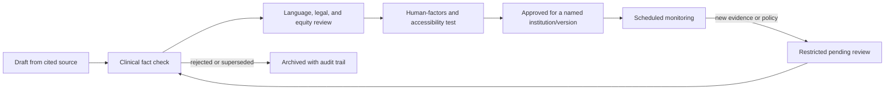

# Product and governance requirements

## Intended-use statement

The proposed feature is a **clinician-mediated educational and communication aid** for explaining stroke anatomy, the purpose and broad course of selected cranial operations, alternatives, uncertainty, and patient-values tradeoffs during an in-person conversation. It is not intended to diagnose, triage, select treatment, calculate prognosis, establish capacity or legal authority, obtain autonomous consent, or replace professional judgment.

Any change toward patient-specific imaging, recommendations, risk calculation, decision capture, remote unsupervised use, or electronic-health-record integration requires a new clinical, privacy, cybersecurity, human-factors, and regulatory assessment.

## Functional requirements

### 1. Clinician-controlled case framing

The clinician chooses the condition and proposed operation. The tool must never infer an operation from symptoms, scan measurements, or demographics. Required opening fields are diagnosis label, immediate danger, decision needed, urgency entered by the clinician, reasonable alternatives, and lead clinician.

### 2. Layered anatomy

Each module needs:

- orientation and normal anatomy;
- the pathology and immediate danger;
- established injury distinguished from reversible pressure/obstruction;
- the operative route and mechanical goal;
- what remains unchanged after the operation;
- postoperative ICU and rehabilitation paths; and
- a reset/home state that returns every transform and layer.

Every model records source, license, creator, modifications, coordinate/scale conventions, medical reviewer, validation method, and version. Educational distortion must be visible in the interface.

### 3. Evidence cards with immutable context

An evidence card must store:

```text
source_id
full_citation
stable_url / doi / pmid
publication_year
source_type and evidence certainty
guideline jurisdiction and recommendation strength
population and key inclusion/exclusion criteria
intervention and comparator
endpoint definition, denominator, and time horizon
absolute outcome distribution where available
important harms
limitations and patient mismatch
clinical reviewer, review date, next review date
superseded/retracted/corrected status
approved family-facing paraphrase
```

Numbers cannot be detached from these fields, copied into a generic surgery card, or transformed into patient-specific estimates.

### 4. Outcome display

- Default to best/most likely/worst plausible trajectories written by the responsible team.
- If numbers are shown, use natural frequencies, a common denominator, the same time point, dual framing, and accessible text alongside graphics.
- Separate death from every disability category; do not merge “mRS 0–4 alive” into a green state.
- Expand mRS labels into concrete assistance while warning that mRS incompletely captures language, cognition, participation, and quality of life.
- Make evidence mismatch visible before the number—not behind an information icon.
- Do not compute a personal percentage or composite “chance of success.”

### 5. Conversation support

The clinician view should provide optional prompts for warning shot, prior understanding, three-part explanation, options, emotion response, values elicitation, recommendation, teach-back, documentation, and next meeting. The family view should remain uncluttered and must not show internal scores, legal judgments, or draft recommendations.

### 6. Distress and accessibility controls

- non-graphic, low-motion, seated 2D, and headset-free modes;
- visible stop/pause/home controls reachable by clinician and viewer;
- captions, VoiceOver-compatible text equivalent, scalable type, high contrast, and non-color status encoding;
- no flashing, forced locomotion, looming anatomy, autoplay blood, or celebratory/failure effects;
- explicit warning and consent before graphic content;
- qualified-interpreter layout with short segments, pause control, and translated institution-approved text;
- no machine-generated consent translation without validated human review.

### 7. Documentation aid, not signature capture

The prototype may generate a de-identified checklist recap for clinician transcription, but must not claim that viewing equals understanding or consent. It must not store names, identifiers, recordings, scans, voiceprints, gaze, hand tracking, or decisions. Future clinical deployment needs institution-approved data flows, retention, access control, audit logging, downtime procedure, and correction handling.

## Prohibited features

- treatment recommendation or “best operation” engine;
- personal outcome or survival calculator;
- mRS/ICH score used to trigger a care limitation;
- generic countdown timer or artificial urgency;
- autonomous capacity or proxy-authority determination;
- consent obtained by checkbox, gaze, gesture, or headset completion;
- unsupported “surgery successful” animation;
- generated anatomy or outcome claims without reviewer approval;
- real patient imaging or health data in the research build;
- emotional-state inference from face, voice, gaze, or behavior;
- dark patterns that favor intervention or non-intervention;
- unsupervised family use of graphic immersive content.

## Content state machine



Only the **approved** state may appear in a clinical build. This repository's research content remains in **draft**.

## Expert review matrix

| Content | Required reviewers |
|---|---|
| Hemispheric and cerebellar infarction | Stroke neurologist, cerebrovascular neurosurgeon, neurointensivist |
| ICH/IVH surgery and minimally invasive comparators | Vascular neurosurgeon, stroke neurologist, neurointensivist |
| aSAH clipping/coiling | Open vascular neurosurgeon and neurointerventionalist |
| CVT | Stroke neurologist and neurosurgeon with CVT experience |
| Ruptured AVM | Multidisciplinary cerebrovascular conference representatives |
| Consent and surrogate language | Institution counsel/ethics, consent-policy owner, clinician |
| Family-facing language | Health-literacy specialist, professional interpreter, patient/family advisers |
| Spatial interaction | Human-factors, accessibility, vestibular/visionOS specialists |
| Content release | Clinical safety officer and product owner, with named accountability |

## Validation plan

### Phase 1 — content validity

- Two independent clinicians verify every claim and number against the source.
- Specialty panel rates accuracy, completeness, balance, and unsafe omission.
- Legal/policy team localizes capacity, emergency treatment, and surrogate roles.
- Back-translation and interpreter review test each supported language.

### Phase 2 — formative human factors

- Simulated sessions with clinicians and trained actors.
- Think-aloud testing with stroke survivors and diverse family advisers, separated from actual emergencies.
- Measure anatomical understanding, purpose-versus-limit understanding, recall of alternatives, uncertainty comprehension, values elicitation, teach-back repair, distress, cybersickness, and clinician workload.
- Actively test for intervention bias, disability bias, anchoring on numbers, and false reassurance from animation.

### Phase 3 — clinical-environment study

Only after governance approval, compare the aid plus usual conversation against usual conversation. Predefine comprehension and process outcomes; do not begin by claiming shorter consent time or improved treatment acceptance is beneficial. Include opt-out, non-headset alternative, adverse-event reporting, and independent monitoring.

## Minimum release checklist

- [ ] Intended use and prohibited use are visible in product and documentation.
- [ ] Each claim resolves to an approved evidence card.
- [ ] No clinical number appears without population, endpoint, denominator, time, and limitation.
- [ ] Mortality and disability are separate.
- [ ] Established injury does not visually reverse.
- [ ] Reasonable non-surgical care is represented accurately.
- [ ] Surgeon/stroke-team recommendation is human-entered and values-linked.
- [ ] Teach-back and follow-up are included.
- [ ] Local emergency consent/capacity policy is current and approved.
- [ ] Qualified interpreter path is tested.
- [ ] Non-graphic, low-motion, accessible, and headset-free alternatives pass testing.
- [ ] No patient data are stored in the prototype.
- [ ] Update monitoring, correction, and recall processes are operational.
- [ ] Named clinical safety owner signs the release.

## Research questions before product commitment

1. Does spatial visualization improve understanding beyond a well-designed 2D diagram under acute stress?
2. Does immersion increase distress, nausea, attentional capture, or perceived pressure to accept surgery?
3. Can clinicians use the tool without lengthening the time to treatment or fragmenting eye contact and empathy?
4. Which outcome view best prevents the survival-equals-recovery error?
5. How should a qualified interpreter share control and line of sight?
6. What should remain clinician-only when family members disagree or legal authority is uncertain?
7. Can the same content be delivered equivalently on a tablet or printed sheet for accessibility and downtime?
8. What governance is required if future versions import imaging or connect to the health record?
